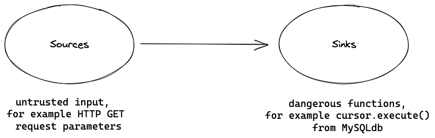
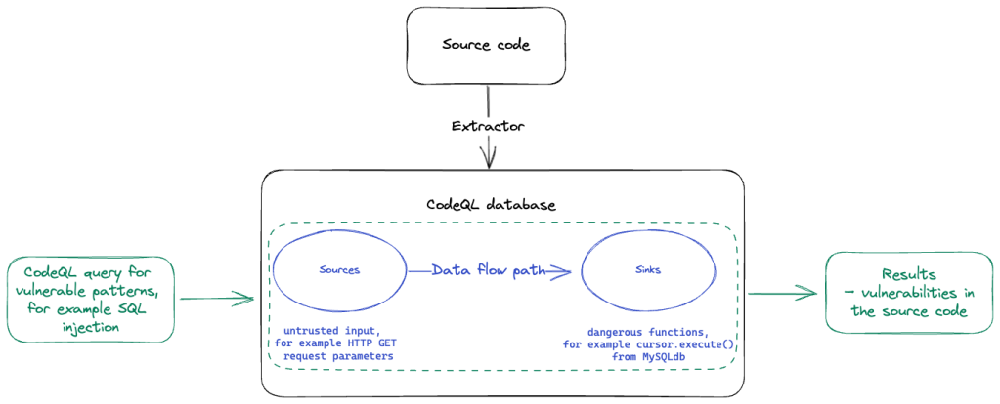

## CodeQL Primer

CodeQL supports the following languages:

```shell
$ codeql resolve languages | cut -d' ' -f1
cpp
html
python
javascript
yaml
java
csharp
swift
xml
ruby
properties
go
csv
```

In this tutorial `javascript` will be used.

1. Download the codeql-cli binary
   1. codeql-cli: https://github.com/github/codeql-cli-binaries/releases
2. Clone the target project
3. Install CodeQL plugin in VSCode
   1. Configure path
   2. Change settings to use `nproc` threads to improve performance
4. Build the database
5. Write the queries
6. Install missing dependencies (qlpacks)
7. Open database (VSCode)
8. `Ctrl+Shift+P` command palette
   1. Run query on selected database

## Introduction

**Source**

User input generally comes from application entry points. These include parameters in HTTP methods (GET, POST, ...), or command line arguments to a program. These are called  "sources". Data is "tainted" if it comes from an insecure source such as a file, the network, or the user.

**Sink**

The destination of a data flow is called “sink”. Our goal is to identify dangerous functions which are sinks to a tainted data flow and might introduce exploitable vulnerabilities.

**Data flow analysis**

The problem we are asked to answer is to identify any data-flow from a source to a sink. Taint analysis checks whether there is a path that tainted data can follow from the source to the sink.

Source: https://github.blog/2023-03-31-codeql-zero-to-hero-part-1-the-fundamentals-of-static-analysis-for-vulnerability-research/

In the following example, written in Java, there is an SQL Injection vulnerability. In this case, sources are `username` and `password` while the sink is `stmt.executeQuery(query)`.

```java
public boolean checkLogin(String username,String password, String user){
    String query="SELECT * FROM users WHERE username='"+username+"' AND password='"+password+"' LIMIT 1";
    try{
        rs=stmt.executeQuery(query);
        if(rs.next()){
            return true;
        }
    }catch(Exception e){
        e.printStackTrace();
    }
    return false;
}
```

## CodeQL

Source: https://github.blog/2023-06-15-codeql-zero-to-hero-part-2-getting-started-with-codeql/

### Basic Syntax

- `from` defines the types and variables that are going to be queried.
- `where` defines conditions on these variables in the form of a logical formula. `where` can be omitted if there are no conditions.
- `select` defines the output of the query.

More advanced syntax constructs will be examined in subsequent blog-posts.

### VSCode Plugin Settings

In file `~/.config/Code/User/settings.json` you should see the following values:

```
{
    ...
    "codeQL.runningQueries.numberOfThreads": 8,
    "codeQL.runningQueries.useExtensionPacks: "all",
    "codeQL.runningTests.numberOfThreads": 4,
    ...
}
```

### Create custom database

Build database:

```shell
$ mkdir -p database

$ codeql database create ./database/<name> --language=<language> --threads=`nproc` --overwrite
```

Write queries:

```shell
$ mkdir -p queries

$ cat << EOF > ./queries/qlpack.yml
name: <scope>/<name>
version: 0.0.0
dependencies:
  codeql/javascript-all: "*"
EOF

$ cat << EOF > ./queries/example.ql
import javascript

from BlockStmt b
select b
EOF
```

**Disclaimers:**

- The images are taken from the Github blog posts that are included in the references section.
- I tried to keep this post short and to the point to be used as a quick reference to someone who would like to get introduced to CodeQL.
- I am currently learning CodeQL myself and the blog posts serve as a place for my notes.

## References

- https://codeql.github.com/docs/writing-codeql-queries/codeql-queries
- https://codeql.github.com/docs/codeql-language-guides/codeql-for-javascript/
- https://github.blog/2023-03-31-codeql-zero-to-hero-part-1-the-fundamentals-of-static-analysis-for-vulnerability-research/
- https://github.blog/2023-06-15-codeql-zero-to-hero-part-2-getting-started-with-codeql/

