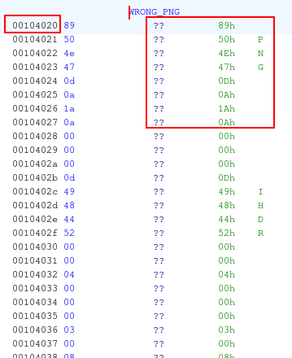
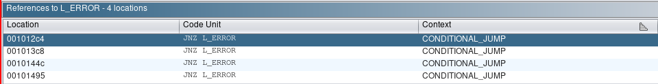

# Free Madame De Maintenon

Challenge: https://hex-rays.com/blog/free-madame-de-maintenon-ctf-challenge/


The provided executable is a 64-bit ELF dynamically linked and stripped binary.

```
➜ file ./challenge
./challenge: ELF 64-bit LSB pie executable, x86-64, version 1 (SYSV), dynamically linked, interpreter /lib64/ld-linux-x86-64.so.2, BuildID[sha1]=83db7b297901c743a71f43e813e3dc266245b220, for GNU/Linux 3.2.0, stripped
```


It has been linked against the following libraries:

```
➜ ldd ./challenge
        linux-vdso.so.1 (0x00007ffee2b5c000)
        libSDL2-2.0.so.0 => /usr/lib/libSDL2-2.0.so.0 (0x00007f85ae726000)
        libSDL2_image-2.0.so.0 => /usr/lib/libSDL2_image-2.0.so.0 (0x00007f85ae706000)
        libc.so.6 => /usr/lib/libc.so.6 (0x00007f85ae51c000)
        libm.so.6 => /usr/lib/libm.so.6 (0x00007f85ae42f000)
        libpng16.so.16 => /usr/lib/libpng16.so.16 (0x00007f85ae3f6000)
        libjxl.so.0.8 => /usr/lib/libjxl.so.0.8 (0x00007f85ae000000)
        libjpeg.so.8 => /usr/lib/libjpeg.so.8 (0x00007f85adf7d000)
        libtiff.so.6 => /usr/lib/libtiff.so.6 (0x00007f85adee6000)
        libwebp.so.7 => /usr/lib/libwebp.so.7 (0x00007f85ae387000)
        libsharpyuv.so.0 => /usr/lib/libsharpyuv.so.0 (0x00007f85adede000)
        /lib64/ld-linux-x86-64.so.2 => /usr/lib64/ld-linux-x86-64.so.2 (0x00007f85aea7e000)
        libz.so.1 => /usr/lib/libz.so.1 (0x00007f85adec4000)
        libhwy.so.1 => /usr/lib/libhwy.so.1 (0x00007f85adeb9000)
        libbrotlidec.so.1 => /usr/lib/libbrotlidec.so.1 (0x00007f85adeab000)
        libbrotlienc.so.1 => /usr/lib/libbrotlienc.so.1 (0x00007f85ade07000)
        libstdc++.so.6 => /usr/lib/libstdc++.so.6 (0x00007f85ada00000)
        libgcc_s.so.1 => /usr/lib/libgcc_s.so.1 (0x00007f85adde2000)
        libzstd.so.1 => /usr/lib/libzstd.so.1 (0x00007f85add0f000)
        liblzma.so.5 => /usr/lib/liblzma.so.5 (0x00007f85adcdc000)
        libbrotlicommon.so.1 => /usr/lib/libbrotlicommon.so.1 (0x00007f85adcb9000)

```


Useful SDL documentation: 

- https://wiki.libsdl.org/wiki/index
- https://wiki.libsdl.org/SDL2/
- https://wiki.libsdl.org/SDL2_image/


Decompiled view in Ghidra:

```c
int main(int argc,char **argv) {  
	[...]
    
    // 0x00: SDL INIT
    SDL_Init(0xf231);
    IMG_Init(IMG_INIT_PNG);
    SDL_CreateWindowAndRenderer(0x280,0x1e0,0,&sdl_window,&sdl_renderer);
    
    // 0x01: CHECK NUMBER OF ARGUMENTS
    if (argc < 2) {
        __fprintf_chk(stderr,1,"You need to give the password as the argument");
        retCode = 1;
        goto L_EXIT;
    }
    
    // 0x02: COPY ARGUMENT TO BUFFER
    // HINT: BUFFER SIZE = 0x18 = 24
    strncpy((char *)buffer,argv[1],0x18);
    
    // 0x03: VARIOUS CHECKS
    [...]
    
    // 0x04: DECRYPT LOGIC
    	sdl_buf = SDL_RWFromConstMem(&GOOD_PNG,0xecd6c);
  	} else {
    // 0x05: FAILED IMAGE
    L_ERROR:
        sdl_buf = SDL_RWFromConstMem(&WRONG_PNG,0x6d1ba);
    }

	// 0x06: LOAD TEXTURE
	// HINT: TEXTURE IS A PNG STORED IN SDL_BUF
    sdl_buf = IMG_LoadTexture_RW(sdl_renderer,sdl_buf,1);

	[...]
}
```


When any of the checks fails, the application loads the PNG stored at offset `0x00004020`:




By finding all references that lead to `L_ERROR` label:

| 001012c4     | JNZ L_ERROR     | CONDITIONAL_JUMP     |      |
| ------------ | --------------- | -------------------- | ---- |
| 001013c8     | JNZ L_ERROR     | CONDITIONAL_JUMP     |      |
| **0010144c** | **JNZ L_ERROR** | **CONDITIONAL_JUMP** |      |
| 00101495     | JNZ L_ERROR     | CONDITIONAL_JUMP     |      |




Ghidra's decompiler shows the following checks are performed:

```c
  if (((((uint)(ushort)buffer._22_2_ + (uint)(ushort)buffer._16_2_) - (uint)(ushort)buffer._8_2_) -
       (uint)(ushort)buffer._14_2_ == 0x1cd4) 
 &&
     ((((uint)(ushort)buffer._2_2_ + (uint)(ushort)buffer._6_2_) - (uint)(ushort)buffer._10_2_) +
      (uint)(ushort)buffer._20_2_ == 0xd899))
```


```c
if ((buffer._0_8_ ^ buffer._16_8_) != 0xa04233a475d1b72) goto L_ERROR;
```


```c
    if (((buffer._20_4_ + buffer._0_4_ * 2 + buffer._8_4_ * -4) - ((uint)buffer._16_4_ >> 3)) -
        ((uint)buffer._4_4_ >> 3) != 0x4b5469c) goto L_ERROR;
```


```c
if ((buffer._16_8_ ^ buffer._8_8_) != 0x231f0b21595d0455) goto L_ERROR;
```


If all of the above checks succeed, then the application decrypts the blob found at offset `0x000711e0` and as shown in the decompiled view at `part:0x06` will load the correct PNG image.

Thus, it is possible to bypass the decryption logic and let the application present us the image by solving the constraints enforced by the above checks.

[Z3 SMT](https://github.com/Z3Prover/z3) can be used to achieve this:

**Install Z3**

```
$ pip install -U z3-solver
```

**Solution**

```python
import string
from z3 import *

TOTAL_ITEMS = 24
ALPHABET = string.printable

u16 = lambda x, y: Concat(x[y + 1], x[y])
u32 = lambda x, y: Concat(x[y + 3], x[y + 2], x[y + 1], x[y])
u64 = lambda x, y: Concat(x[y + 7], x[y + 6], x[y + 5], x[y + 4], x[y + 3], x[y + 2], x[y + 1], x[y])

solver = Solver()

'''
0010127b 48 8b 75 08     MOV        RSI,qword ptr [RBP + 0x8] ; second parameter
[...]
00101283 ba 18 00        MOV        EDX,0x18 ; third parameter
            00 00
00101288 48 8d 7c        LEA        RDI=>buffer,[RSP + 0x50] ; first parameter
            24 50
0010128d 48 c7 44        MOV        qword ptr [RSP + 0x60]=>buffer[16],0x0
            24 60 00 
            00 00 00
00101296 c6 44 24        MOV        byte ptr [RSP + 0x68]=>local_40,0x0
            68 00
[...]
001012a0 e8 db fe        CALL       libc.so.6::strncpy
            ff ff
'''
x = [ BitVec(f'x[{ix}]',  8) for ix in range(TOTAL_ITEMS) ]


''' Printable characters: http://facweb.cs.depaul.edu/sjost/it212/documents/ascii-pr.htm '''
solver.add(
        [x_i >= ord(' ') for x_i in x] + [x_i <= ord('~') for x_i in x]
)


'''
001012a5 0f b7 54        MOVZX      EDX,word ptr [RSP + 0x60]=>buffer[16]
            24 60
001012aa 0f b7 44        MOVZX      EAX,word ptr [RSP + 0x66]=>buffer[22]
            24 66
001012af 01 d0           ADD        EAX,EDX ; (word)buffer[16] + word(buffer[22])
001012b1 0f b7 54        MOVZX      EDX,word ptr [RSP + 0x58]=>buffer[8]
            24 58
001012b6 29 d0           SUB        EAX,EDX ; (word)buffer[16] + word(buffer[22]) - word(buffer[8])
001012b8 0f b7 54        MOVZX      EDX,word ptr [RSP + 0x5e]=>buffer[14]
            24 5e
001012bd 29 d0           SUB        EAX,EDX ; (word)buffer[16] + word(buffer[22]) - word(buffer[8]) - word(buffer[14])
001012bf 3d d4 1c        CMP        EAX,0x1cd4 ; if result != 0x1cd4 : goto L_ERROR
            00 00
001012c4 75 25           JNZ        L_ERROR
'''
solver.add(
    u16(x, 16) + u16(x, 22) - u16(x, 8) - u16(x, 14) == BitVecVal(0x1cd4, 16)
)


'''
001012c6 0f b7 54        MOVZX      EDX,word ptr [RSP + 0x56]=>buffer[6]
            24 56
001012cb 0f b7 44        MOVZX      EAX,word ptr [RSP + 0x52]=>buffer[2]
            24 52
001012d0 01 d0           ADD        EAX,EDX ; word(buffer[6]) + word(buffer[2])
001012d2 0f b7 54        MOVZX      EDX,word ptr [RSP + 0x5a]=>buffer[10]
            24 5a
001012d7 29 d0           SUB        EAX,EDX ; word(buffer[6]) + word(buffer[2]) - word(buffer[10])
001012d9 0f b7 54        MOVZX      EDX,word ptr [RSP + 0x64]=>buffer[20]
            24 64
001012de 01 d0           ADD        EAX,EDX ; word(buffer[6]) + word(buffer[2]) - word(buffer[10]) + word(buffer[20])
001012e0 3d 99 d8        CMP        EAX,0xd899 ; if result != 0xd899 : goto L_ERROR
            00 00
001012e5 0f 84 c3        JZ         L_NEXT_CHECK
'''
solver.add(
    u16(x, 6) + u16(x, 2) - u16(x, 10) + u16(x, 20) == BitVecVal(0xd899, 16)
)


'''
001013ae 4c 8b 44        MOV        R8,qword ptr [RSP + 0x60]=>buffer[16]
            24 60
001013b3 48 8b 54        MOV        RDX,qword ptr [RSP + 0x50]=>buffer[0]
            24 50
001013b8 48 b8 72        MOV        RAX,0xa04233a475d1b72
            1b 5d 47 
            3a 23 04 0a
001013c2 4c 31 c2        XOR        RDX,R8 ; qword(buffer[0]) ^ qword(buffer[16])
001013c5 48 39 c2        CMP        RDX,RAX ; if result != 0xa04233a475d1b72 : goto L_ERROR
001013c8 0f 85 1d        JNZ        L_ERROR
'''
solver.add(
    u64(x, 0) ^ u64(x, 16) == BitVecVal(0xa04233a475d1b72, 64)
)


'''
0010141d 8b 54 24 50     MOV        EDX,dword ptr [RSP + 0x50]=>buffer[0] ; dword(buffer[0])
00101421 8b 44 24 64     MOV        EAX,dword ptr [RSP + 0x64]=>buffer[20] ; dword(buffer[20])
00101425 8b 5c 24 58     MOV        EBX,dword ptr [RSP + 0x58]=>buffer[8] ; dword(buffer[8])
00101429 8d 04 50        LEA        EAX,[RAX + RDX*0x2] ; EAX = RAX + 2 * RDX = dword(buffer[20]) + 2 * dword(buffer[0])
0010142c 8d 14 9d        LEA        EDX,[RBX*0x4] ; EDX = 4 * RBX = 4 * dword(buffer[8])
            00 00 00 00
00101433 29 d0           SUB        EAX,EDX ; dword(buffer[20]) + 2 * dword(buffer[0]) - 4 * dword(buffer[8])
00101435 8b 54 24 60     MOV        EDX,dword ptr [RSP + 0x60]=>buffer[16] ; dword(buffer[16])
00101439 c1 ea 03        SHR        EDX,0x3 ; dword(buffer[16]) >> 3
0010143c 29 d0           SUB        EAX,EDX ; dword(buffer[20]) + 2 * dword(buffer[0]) - 4 * dword(buffer[8]) - (dword(buffer[16]) >> 3)
0010143e 8b 54 24 54     MOV        EDX,dword ptr [RSP + 0x54]=>buffer[4] ; dword(buffer[4])
00101442 c1 ea 03        SHR        EDX,0x3 ; dword(buffer[4]) >> 3
00101445 29 d0           SUB        EAX,EDX ; dword(buffer[20]) + 2 * dword(buffer[0]) - 4 * dword(buffer[8]) - (dword(buffer[16]) >> 3) - (dword(buffer[4]) >> 3)
00101447 3d 9c 46        CMP        EAX,0x4b5469c ; if result != 0x4b5469c : goto L_ERROR
            b5 04
0010144c 0f 85 99        JNZ        L_ERROR
            fe ff ff
'''
solver.add(
    u32(x, 20) + 2 * u32(x, 0) - 4 * u32(x, 8) - (u32(x, 16) >> 3)  - (u32(x, 4) >> 3) == BitVecVal(0x4b5469c, 32)
)


'''
001013ae 4c 8b 44        MOV        R8,qword ptr [RSP + 0x60]=>buffer[16]; qword(buffer[16])
            24 60
[...]
00101483 48 b8 55        MOV        RAX,0x231f0b21595d0455
            04 5d 59 
            21 0b 1f 23
0010148d 4c 33 44        XOR        R8,qword ptr [RSP + 0x58]=>buffer[8] ; qword(buffer[16]) ^ qword(buffer[8])
            24 58
00101492 49 39 c0        CMP        R8,RAX ; qword(buffer[16]) ^ qword(buffer[8]) == 0x231f0b21595d0455
00101495 0f 85 50        JNZ        L_ERROR
            fe ff ff
'''
solver.add(
    u64(x, 16) ^ u64(x, 8) == BitVecVal(0x231f0b21595d0455, 64)
)


if solver.check() == sat:
    model = solver.model()
    result = [model[x[i]].as_long() for i in range(TOTAL_ITEMS)]
    result = ''.join(chr(c) for c in result)
    print(result)
else:
    print('No solution found.')

```

```
Fr33_M4dam3-De/M4inten0n
```


## References

- https://wiki.libsdl.org/SDL2/SDL_RWFromConstMem
- https://z3prover.github.io/api/html/namespacez3py.html
