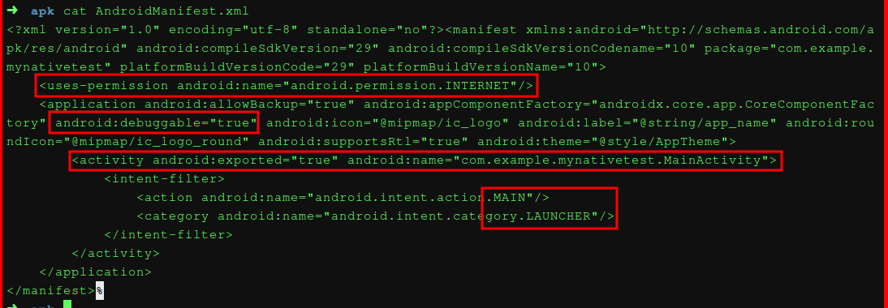
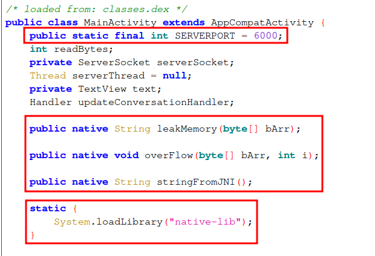
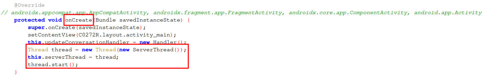
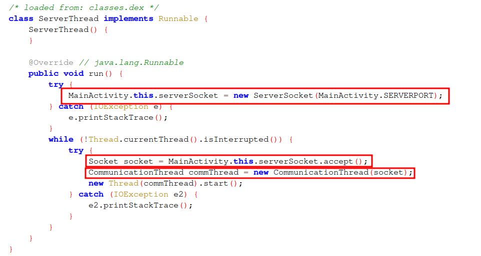
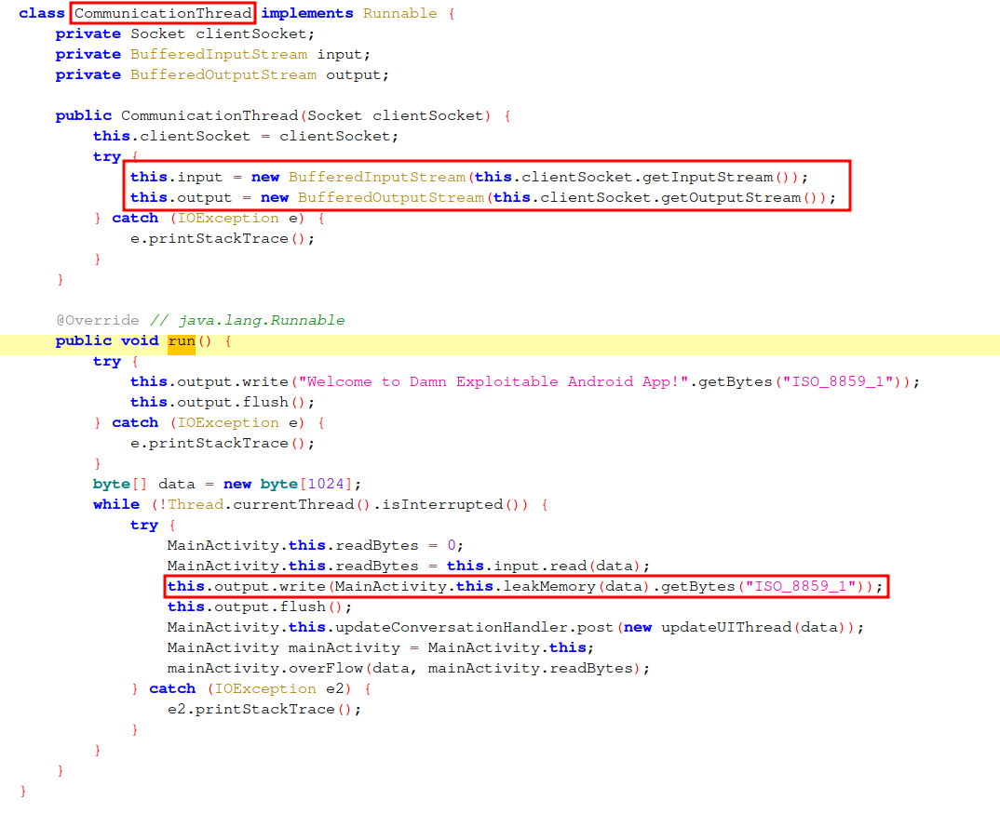
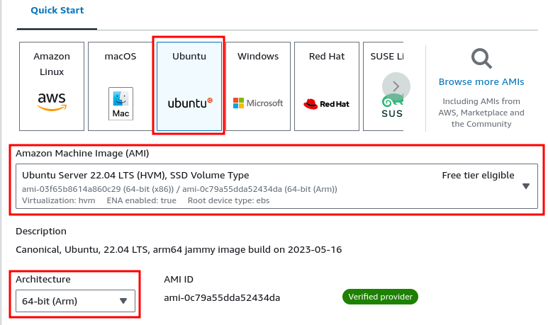
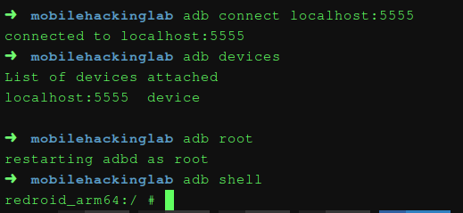

## APK Analysis

### Parsing AndroidManifest.xml

```
$ wget https://github.com/mobilehackinglab/damn-exploitable-android-app-public-apk/raw/main/app-debug.apk
```

```
./aapt dump badging ~/Downloads/mobilehackinglab/app-debug.apk
package: name='com.example.mynativetest' versionCode='1' versionName='1.0' platformBuildVersionName='10' platformBuildVersionC
ode='29' compileSdkVersion='29' compileSdkVersionCodename='10'
sdkVersion:'15'
targetSdkVersion:'29'
uses-permission: name='android.permission.INTERNET'
[...]
application: label='Damn Exploitable Android App' icon='res/mipmap-anydpi-v26/ic_logo.xml'
application-debuggable
launchable-activity: name='com.example.mynativetest.MainActivity'  label='' icon=''
```

```
apktool d app-debug.apk -oapk
```

The same information could be obtained by reading directly the `AndroidManifest.xml` file:



### JADX-GUI









### Analyzing native library

```c

jobject Java_com_example_mynativetest_MainActivity_leakMemory
                  (JNIEnv *env,jobject thiz,jbyteArray arr)

{ 
  [...]
  array = arr;
  env_copy = env;
  [...]
  
  // get the cstring representation
  fmt = (char *)_JNIEnv::GetByteArrayElements((_JNIEnv *)env_copy,(_jbyteArray *)array,&isCopy);
  
  // fmt is user controlled => tainted
  // vulnerable to format string attack
  // it should be: snprintf((char *)&str,0x28,"%s",fmt);
  snprintf((char *)&str,0x28,fmt);
  
  [...]
}
```


```c

undefined Java_com_example_mynativetest_MainActivity_overFlow
                    (JNIEnv *env,jobject thiz,jbyteArray array,jint count)
{
  undefined uVar1;
  char *buf;
  uchar isCopy;
  jint bytes_cnt;
  jbyteArray local_14;
  jobject local_10;
  JNIEnv *local_c;
  
  bytes_cnt = count;
  local_14 = array;
  local_10 = thiz;
  local_c = env;
  buf = (char *)_JNIEnv::GetByteArrayElements((_JNIEnv *)env,(_jbyteArray *)array,&isCopy);
  uVar1 = cp(buf,bytes_cnt);
  return uVar1;
}
```


```c
void cp(char *buf,int cnt)
{
  char dest [200];
  int count;
  char *src;
  
  count = cnt;
  src = buf;
	
  // memset(dest, '\0', 200)
  __aeabi_memclr(dest,200);
    
  // src[0] == '0'
  // src[1] == 'x'
  // src[2] == 'f'
  // src[3] == 'a'
  if ((((0 < count) && (*src == '0')) && (src[1] == 'x')) && ((src[2] == 'f' && (src[3] == 'a')))) {
    // count is user controlled => tainted
    // it is not checked that 0 < count < 200
    // leads to stack buffer overflow vulnerability
    __aeabi_memcpy(dest,src,count);
  }
  return;
}
```


## Lab Setup



```bash
set -euxo pipefail

echo "[*] Updating the system..."
sudo apt-get update -y

echo "[*] Installing required tools..."
sudo apt-get install -y \
    ca-certificates \
    curl \
    gnupg \
    lsb-release

echo "[*] Installing docker..."
sudo mkdir -m 0755 -p /etc/apt/keyrings
curl -fsSL https://download.docker.com/linux/ubuntu/gpg | sudo gpg --dearmor -o /etc/apt/keyrings/docker.gpg
echo \
  "deb [arch=$(dpkg --print-architecture) trusted=yes signed-by=/etc/apt/keyrings/docker.gpg] https://download.docker.com/linux/ubuntu \
  $(lsb_release -cs) stable" | sudo tee /etc/apt/sources.list.d/docker.list > /dev/null
sudo apt-get update -y
sudo apt-get install -y docker-ce docker-ce-cli containerd.io docker-buildx-plugin docker-compose-plugin

echo "[*] Adding user into docker group..."
sudo usermod -aG docker $USER

echo "[*] Reboot the system..."
```

Install the required kernel modules for running the container:

```
sudo apt install -y linux-modules-extra-`uname -r`
```

Install ADB to be able to connect to the device:

```
sudo apt-get install -y android-tools-adb
```

Redroid Docker for ARM Android: [https://hub.docker.com/r/redroid/redroid](https://hub.docker.com/r/redroid/redroid)

```
sudo modprobe binder_linux devices="binder,hwbinder,vndbinder"
sudo modprobe ashmem_linux
```

```
sudo docker run -itd --privileged \
 --name androidemu \
 -v ~/data:/data \
 -p 5555:5555 \
 redroid/redroid:11.0.0-latest
```



```
$ ~/Android/Sdk/build-tools/34.0.0-rc3/aapt2 dump packagename app-debug.apk
com.example.mynativetest
```

```
redroid_arm64:/ # am start com.example.mynativetest/.MainActivity
```

```
$ scrcpy -s localhost:5555
```


