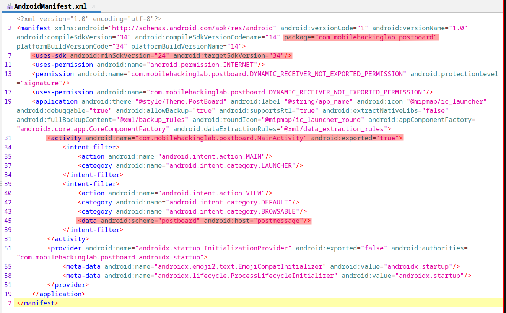
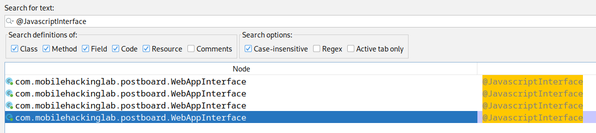
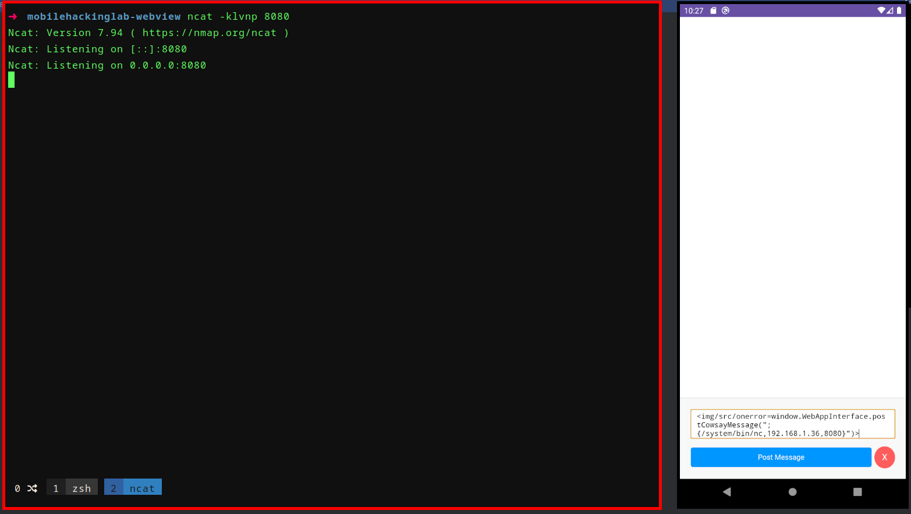
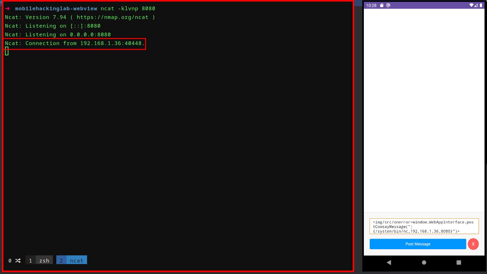

## Description

This challenge is designed to delve into the complexities of Android's  WebView component, exploiting a Cross-Site Scripting (XSS) vulnerability to achieve Remote Code Execution (RCE). It's a great opportunity to  engage with Android application security focusing on WebView security  issues.

We are given an Android application with a WebView component that is vulnerable to XSS and exposes a Java interface to the WebView ( `addJavascriptInterface` ).

### Methodology

1. Identify the XSS vulnerability within the WebView component.
2. Craft a JavaScript payload to exploit this vulnerability.
3. Leverage the exposed Java interface through the XSS to achieve RCE.




```java
private final void setupWebView(WebView webView) {
    webView.getSettings().setJavaScriptEnabled(true);
    webView.setWebChromeClient(new WebAppChromeClient());
    webView.addJavascriptInterface(new WebAppInterface(), "WebAppInterface");
    webView.loadUrl("file:///android_asset/index.html");
}
```

```java
private final void handleIntent() {
    Intent intent = getIntent();
    String action = intent.getAction();
    Uri data = intent.getData();
    if (!Intrinsics.areEqual("android.intent.action.VIEW", action) || data == null || !Intrinsics.areEqual(data.getScheme(), "postboard") || !Intrinsics.areEqual(data.getHost(), "postmessage")) {
        return;
    }
    ActivityMainBinding activityMainBinding = null;
    try {
        String path = data.getPath();
        byte[] decode = Base64.decode(path != null ? StringsKt.drop(path, 1) : null, 8);
        Intrinsics.checkNotNullExpressionValue(decode, "decode(...)");
        String message = StringsKt.replace$default(new String(decode, Charsets.UTF_8), "'", "\\'", false, 4, (Object) null);
        ActivityMainBinding activityMainBinding2 = this.binding;
        if (activityMainBinding2 == null) {
            Intrinsics.throwUninitializedPropertyAccessException("binding");
            activityMainBinding2 = null;
        }
        activityMainBinding2.webView.loadUrl("javascript:WebAppInterface.postMarkdownMessage('" + message + "')");
    } catch (Exception e) {
        ActivityMainBinding activityMainBinding3 = this.binding;
        if (activityMainBinding3 == null) {
            Intrinsics.throwUninitializedPropertyAccessException("binding");
        } else {
            activityMainBinding = activityMainBinding3;
        }
        activityMainBinding.webView.loadUrl("javascript:WebAppInterface.postCowsayMessage('" + e.getMessage() + "')");
    }
}
```

```html
<div class="message-input">
    <textarea id="message" placeholder="Write your Markdown message here"></textarea>
    <div class="button-group">
        <button onclick="postMessage()" class="post-message-button">Post Message</button>
        <button onclick="clearMessages()" class="clear-button">X</button>
    </div>
</div>
```

```js
<script>
    function postMessage() {
        var message = document.getElementById('message');

        // Call JavaScript interface to post message
        window.WebAppInterface.postMarkdownMessage(message.value);

        message.value = '';

        // Update the message board
        updateMessages();
    }

    function updateMessages() {
        var jsonString = window.WebAppInterface.getMessages();
        var messages = JSON.parse(jsonString);

        var messageBoard = document.getElementById('messageBoard');
        messageBoard.innerHTML = ''; // Clear message board

        // Add messages as sticky notes to the message board
        messages.forEach(function(message) {
            var stickyNote = document.createElement('div');
            stickyNote.className = 'sticky-note';
            stickyNote.innerHTML = message;
            messageBoard.appendChild(stickyNote);
        });

        // Scroll to the bottom of the message board
        messageBoard.scrollTop = messageBoard.scrollHeight;
    }

    function clearMessages() {
        var messageBoard = document.getElementById('messageBoard');
        messageBoard.innerHTML = ''; // Clear message board

        // Call JavaScript interface to clear cache
        window.WebAppInterface.clearCache();
    }

    updateMessages();

</script>
```

```java
public final String runCowsay(String message) {
    Intrinsics.checkNotNullParameter(message, "message");
    try {
        String[] command = {"/bin/sh", "-c", CowsayUtil.scriptPath + ' ' + message};
        Process process = Runtime.getRuntime().exec(command);
        StringBuilder output = new StringBuilder();
        InputStream inputStream = process.getInputStream();
        Intrinsics.checkNotNullExpressionValue(inputStream, "getInputStream(...)");
        InputStreamReader inputStreamReader = new InputStreamReader(inputStream, Charsets.UTF_8);
        BufferedReader bufferedReader = inputStreamReader instanceof BufferedReader ? (BufferedReader) inputStreamReader : new BufferedReader(inputStreamReader, 8192);
        BufferedReader reader = bufferedReader;
        while (true) {
            String it = reader.readLine();
            if (it == null) {
                Unit unit = Unit.INSTANCE;
                Closeable.closeFinally(bufferedReader, null);
                process.waitFor();
                String sb = output.toString();
                Intrinsics.checkNotNullExpressionValue(sb, "toString(...)");
                return sb;
            }
            output.append(it).append("\n");
        }
    } catch (Exception e) {
        e.printStackTrace();
        return "cowsay: " + e.getMessage();
    }
}
```



```java
@JavascriptInterface
public final void postCowsayMessage(String cowsayMessage) {
    Intrinsics.checkNotNullParameter(cowsayMessage, "cowsayMessage");
    String asciiArt = CowsayUtil.Companion.runCowsay(cowsayMessage);
    String html = StringsKt.replace$default(StringsKt.replace$default(StringsKt.replace$default(StringsKt.replace$default(StringsKt.replace$default(asciiArt, "&", "&amp;", false, 4, (Object) null), "<", "&lt;", false, 4, (Object) null), ">", "&gt;", false, 4, (Object) null), "\"", "&quot;", false, 4, (Object) null), "'", "&#039;", false, 4, (Object) null);
    this.cache.addMessage("<pre>" + StringsKt.replace$default(html, "\n", "<br>", false, 4, (Object) null) + "</pre>");
}
```


### Debugging with Frida

```js
Java.perform(function() {

    let InputStreamReader = Java.use('java.io.InputStreamReader');
    let BufferedReader = Java.use("java.io.BufferedReader");
    let Runtime = Java.use('java.lang.Runtime');
    
    /* Payloads:
        -|  
    */

    Runtime.exec.overload('[Ljava.lang.String;').implementation = function(msg) {
        console.log(`Entered exec: ${msg}`);

        let process = this.exec(msg);
        
        let inputstream = process.getInputStream();
        let ireader = InputStreamReader.$new(inputstream);
        let reader = BufferedReader.$new(ireader, 8192);
        

        while (true) {
            let line = reader.readLine();
            if (line == null) {
                break;
            }
            console.log(line);
        }
        
        return process;
    }
});
```




