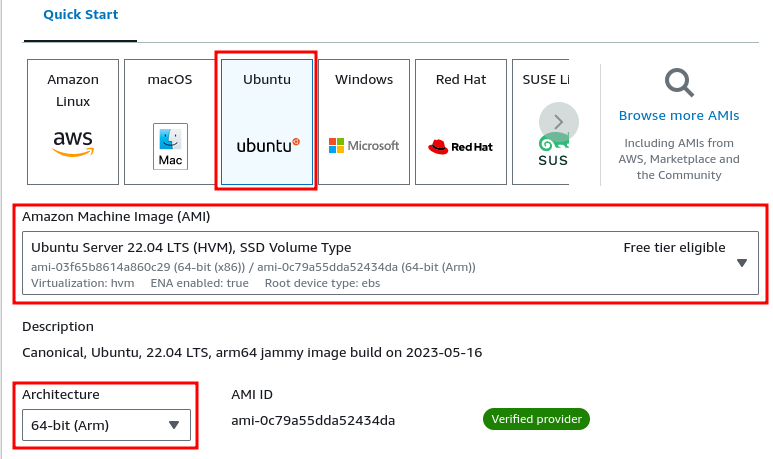

## APK ANALYSIS

### AndroidManifest.xml

```xml
<?xml version="1.0" encoding="utf-8"?>
<manifest 
 [...]         package="com.example.mynativetest">
    <uses-sdk android:minSdkVersion="25" android:targetSdkVersion="29"/>
    <uses-permission android:name="android.permission.INTERNET"/>
[...]
        <activity android:name="com.example.mynativetest.MainActivity" android:exported="true">
            <intent-filter>
                <action android:name="android.intent.action.MAIN"/>
                <category android:name="android.intent.category.LAUNCHER"/>
            </intent-filter>
        </activity>
    </application>
</manifest>
```

### DECOMPILATION

When the application is launched and the main class is instantiated, the native library `libnative-lib.so`:

```java
public class MainActivity extends AppCompatActivity {
    public static final int SERVERPORT = 6000;
    
    [...]

    public native void overFlow(byte[] bArr, int i);

    public native void printLog();

    static {
       System.loadLibrary("native-lib");
    }
```

Then, the `onCreate` callback will be triggered:

```java
protected void onCreate(Bundle savedInstanceState) {
        super.onCreate(savedInstanceState);
[...]
    Thread thread = new Thread(new ServerThread());
        this.serverThread = thread;
        thread.start();
    }
```

Then a new `serverThread` instance is created and it's constructor is called. Then, `thread.start()` trigger `run()` method:

```java
class ServerThread implements Runnable {
        ServerThread() {
        }

        @Override // java.lang.Runnable
        public void run() {
            try {
                MainActivity.this.serverSocket = new ServerSocket(MainActivity.SERVERPORT);
            } catch (IOException e) {
                e.printStackTrace();
            }
            while (!Thread.currentThread().isInterrupted()) {
                try {
                    Socket socket = MainActivity.this.serverSocket.accept();
                    CommunicationThread commThread = new CommunicationThread(socket);
                    new Thread(commThread).start();
                } catch (IOException e2) {
                    e2.printStackTrace();
                }
            }
        }
    }
```

```java
class CommunicationThread implements Runnable {
        private Socket clientSocket;
        private BufferedInputStream input;
        private BufferedOutputStream output;

        public CommunicationThread(Socket clientSocket) {
            this.clientSocket = clientSocket;
            try {
                this.input = new BufferedInputStream(this.clientSocket.getInputStream());
                this.output = new BufferedOutputStream(this.clientSocket.getOutputStream());
            } catch (IOException e) {
                e.printStackTrace();
            }
        }

        @Override // java.lang.Runnable
        public void run() {
            try {
                this.output.write("Welcome to Damn Exploitable Android App!".getBytes("ISO_8859_1"));
                this.output.flush();
            } catch (IOException e) {
                e.printStackTrace();
            }
            byte[] data = new byte[1024];
            while (!Thread.currentThread().isInterrupted()) {
                try {
                    MainActivity.this.readBytes = 0;
                    MainActivity.this.readBytes = this.input.read(data);
                    this.output.flush();
                    MainActivity.this.updateConversationHandler.post(new updateUIThread(data));
                    MainActivity mainActivity = MainActivity.this;
                    mainActivity.overFlow(data, mainActivity.readBytes);
                } catch (IOException e2) {
                    e2.printStackTrace();
                }
            }
        }
    }
```

Finally, `overflow` is called, which is a native function inside `libnative-lib.so`.

### DISASSEMBLY

```asm
Java_com_example_mynativetest_MainActivity_overFlow
        00100e10 ff 03 01 d1     sub        sp,sp,#0x40
        00100e14 fd 7b 03 a9     stp        x29,x30,[sp, #0x30]=>local_10
        00100e18 fd c3 00 91     add        x29,sp,#0x30
        00100e1c a0 83 1f f8     stur       x0,[x29, #-0x8]=>local_18
        00100e20 a1 03 1f f8     stur       x1,[x29, #-0x10]=>local_20
        00100e24 e2 0f 00 f9     str        x2,[sp, #0x18]=>local_28
        00100e28 e3 17 00 b9     str        w3,[sp, #0x14]=>len
        00100e2c a0 83 5f f8     ldur       x0,[x29, #-0x8]=>local_18
        00100e30 e1 0f 40 f9     ldr        x1,[sp, #0x18]=>local_28
        00100e34 e2 4f 00 91     add        x2,sp,#0x13
        00100e38 3a 00 00 94     bl         _JNIEnv::GetByteArrayElements
        00100e3c e0 07 00 f9     str        x0,[sp, #0x8]=>local_38
        00100e40 e0 07 40 f9     ldr        x0,[sp, #0x8]=>local_38
        00100e44 e1 17 40 b9     ldr        w1,[sp, #0x14]=>len
        00100e48 3a 00 00 94     bl         cp
        00100e4c fd 7b 43 a9     ldp        x29=>local_10,x30,[sp, #0x30]
        00100e50 ff 03 01 91     add        sp,sp,#0x40
        00100e54 c0 03 5f d6     ret

```

Which translates to the following C-like code:

```c
void Java_com_example_mynativetest_MainActivity_overFlow
               (JNIEnv *env,jobject thiz,jbyteArray array,jint array_size)
{
  char *c_str;
  jint jVar1;
  uchar isCopy;
  int len;
  jbyteArray local_28;
  jobject local_20;
  JNIEnv *local_18;
  
  len = (int)array_size;
  local_28 = array;
  local_20 = thiz;
  local_18 = env;
  c_str = (char *)_JNIEnv::GetByteArrayElements((_JNIEnv *)env,(_jbyteArray *)array,&isCopy);
  (void)cp(c_str,len);
  return;
}
```

Then, `cp` function is called:

```asm
_Z2cpPKci => cp
        00100d18 ff c3 03 d1     sub        sp,sp,#0xf0
        00100d1c fd 7b 0e a9     stp        x29,x30,[sp, #0xe0]=>local_10
        00100d20 fd 83 03 91     add        x29,sp,#0xe0
        00100d24 a8 23 00 d1     sub        x8,x29,#0x8
        00100d28 e8 03 00 f9     str        x8,[sp]=>local_f0
        00100d2c 00 01 00 f9     str        x0,[x8]=>src
        00100d30 a1 43 1f b8     stur       w1,[x29, #-0xc]=>cnt
        00100d34 e0 33 00 91     add        x0,sp,#0xc
        00100d38 e1 03 1f 2a     mov        w1,wzr
        00100d3c 02 19 80 d2     mov        x2,#0xc8
        00100d40 6c 00 00 94     bl         <EXTERNAL>::memset                               void * memset(void * __s, int __
        00100d44 a8 43 5f b8     ldur       w8,[x29, #-0xc]=>cnt
        00100d48 08 01 00 71     subs       w8,w8,#0x0
        00100d4c 4c 00 00 54     b.gt       LAB_00100d54
        00100d50 1a 00 00 14     b          LAB_00100db8
LAB_00100d54:
        00100d54 e8 03 40 f9     ldr        x8,[sp]=>local_f0
        00100d58 08 01 40 f9     ldr        x8=>src,[x8]
        00100d5c 08 01 40 39     ldrb       w8,[x8]
        00100d60 08 c1 00 71     subs       w8,w8,#0x30
        00100d64 a1 02 00 54     b.ne       LAB_00100db8
        00100d68 e8 03 40 f9     ldr        x8,[sp]=>local_f0
        00100d6c 08 01 40 f9     ldr        x8=>src,[x8]
        00100d70 08 05 40 39     ldrb       w8,[x8, #0x1]
        00100d74 08 e1 01 71     subs       w8,w8,#0x78
        00100d78 01 02 00 54     b.ne       LAB_00100db8
        00100d7c e8 03 40 f9     ldr        x8,[sp]=>local_f0
        00100d80 08 01 40 f9     ldr        x8=>src,[x8]
        00100d84 08 09 40 39     ldrb       w8,[x8, #0x2]
        00100d88 08 99 01 71     subs       w8,w8,#0x66
        00100d8c 61 01 00 54     b.ne       LAB_00100db8
        00100d90 e8 03 40 f9     ldr        x8,[sp]=>local_f0
        00100d94 08 01 40 f9     ldr        x8=>src,[x8]
        00100d98 08 0d 40 39     ldrb       w8,[x8, #0x3]
        00100d9c 08 85 01 71     subs       w8,w8,#0x61
        00100da0 c1 00 00 54     b.ne       LAB_00100db8
        00100da4 e8 03 40 f9     ldr        x8,[sp]=>local_f0
        00100da8 01 01 40 f9     ldr        x1,[x8]=>src
        00100dac a2 43 9f b8     ldursw     x2,[x29, #-0xc]=>cnt
        00100db0 e0 33 00 91     add        x0,sp,#0xc
        00100db4 53 00 00 94     bl         <EXTERNAL>::memcpy
LAB_00100db8: 
        00100db8 fd 7b 4e a9     ldp        x29=>local_10,x30,[sp, #0xe0]
        00100dbc ff c3 03 91     add        sp,sp,#0xf0
        00100dc0 c0 03 5f d6     ret
```

Which translates to:

```c
void cp(char *buf,int count)
{
  char dest [200];
  int cnt;
  char *src;
  
  cnt = count;
  src = buf;
  memset(dest,0,200);
  if ((((0 < cnt) && (*src == '0')) && (src[1] == 'x')) && ((src[2] == 'f' && (src[3] == 'a')))) {
    memcpy(dest,src,(long)cnt);
  }
  return;
}
```

A stack buffer of 200 bytes is declared and initialized to zero using `memset()`. There is a check such as the given string must start with `0xfa`. If this constraint is met, the code copies `cnt` bytes from `src` to `dst` buffers. The problem is, that the `cnt` value is user-controlled (tainted) and leads to a stack buffer overflow when `cnt >= 200`.

## LAB SETUP

**Step 1:** Create the ARM Virtual Machine

>  Note: Here I used Ubuntu 22.04 but Ubuntu 20.04 seems to be a better choice.



**Step 2:** Install the required packages and load the required kernel modules

```bash
set -euxo pipefail

echo "[*] Updating the system..."
sudo apt-get update -y

echo "[*] Installing required tools..."
sudo apt-get install -y \
    ca-certificates \
    curl \
    gnupg \
    lsb-release

echo "[*] Installing docker..."
sudo mkdir -m 0755 -p /etc/apt/keyrings
curl -fsSL https://download.docker.com/linux/ubuntu/gpg | sudo gpg --dearmor -o /etc/apt/keyrings/docker.gpg
echo \
  "deb [arch=$(dpkg --print-architecture) trusted=yes signed-by=/etc/apt/keyrings/docker.gpg] https://download.docker.com/linux/ubuntu \
  $(lsb_release -cs) stable" | sudo tee /etc/apt/sources.list.d/docker.list > /dev/null
sudo apt-get update -y
sudo apt-get install -y docker-ce docker-ce-cli containerd.io docker-buildx-plugin docker-compose-plugin

echo "[*] Adding user into docker group..."
sudo usermod -aG docker $USER

echo "[*] Installing kernel modules..."
sudo apt install -y linux-modules-extra-`uname -r` linux-modules-`uname -r`

echo "[*] Installing adb tools..."
sudo apt-get install -y android-tools-adb

echo "[*] Setting required kernel modules to load automatically..."
cat << EOF | sudo tee -a /etc/modules-load.d/android.conf
binder_linux
ashmem_linux
EOF

echo "[*] Reboot the system..."
```

**Step 3:** Reboot the system

```
$ sudo reboot
```

**Step 4:** Load the required kernel modules and run the Android Emulator

```
sudo modprobe binder_linux devices=binder,hwbinder,vndbinder
sudo modprobe ashmem_linux
```

```
sudo docker run -itd --privileged \
 --name androidemu \
 -v ~/data:/data \
 -p 5555:5555 \
 -p 6000:6000 \
 -p 9999:9999 \
 redroid/redroid:11.0.0-latest
```

**Step 5:** Launch the application

```
# connect to the remote instance
$ adb connect localhost:5555

# install target application
$ adb install ret2win.apk

# start MainActivity
$ adb shell am start com.example.mynativetest/.MainActivity

# verify that the application is listening on port 6000
redroid_arm64:/ # netstat -altnp
Active Internet connections (established and servers)
Proto Recv-Q Send-Q Local Address           Foreign Address         State       PID/Program Name

tcp6       0      0 :::5037                 :::*                    LISTEN      1365/adbd
tcp6       0      0 :::6000                 :::*                    LISTEN      1416/com.example.mynativetest
tcp6       0      0 :::5555                 :::*                    LISTEN      1365/adbd
tcp6       0      0 ::ffff:172.17.0.2:5555  ::ffff:172.17.0.1:55606 ESTABLISHED 1365/adbd

```

Alternative:

...

## EXPLOITATION

### RECON

```
$ checksec --file=./libnative-lib.so
Arch:     aarch64-64-little
RELRO:    Full RELRO
Stack:    No canary found
NX:       NX enabled
PIE:      PIE enabled
```

- No Stack Canary!

```
$ file libnative-lib.so
libnative-lib.so: ELF 64-bit LSB shared object, ARM aarch64, version 1 (SYSV), dynamically linked, BuildID[sha1]=503368fd0bbc7fd9db967e97dbe921e9d0203a4a, stripped
```

- Stripped binary.

### GDB - DEBUGGING

...

### EXPLOIT

...