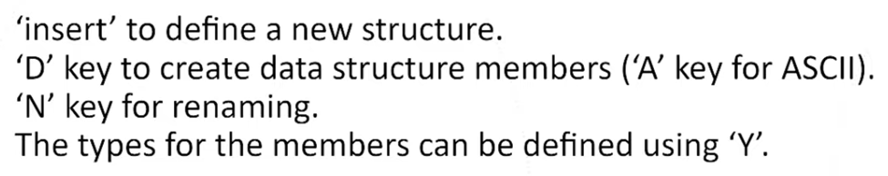
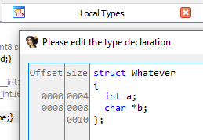
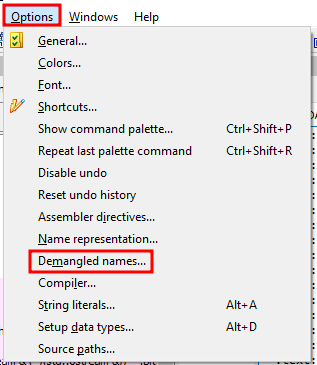
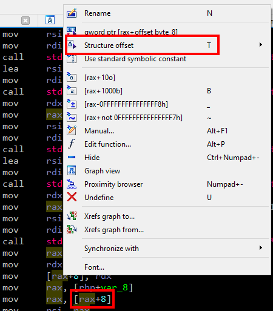

## General


`x86_64` registers:

```
64-bit register | Lower 32 bits | Lower 16 bits | Lower 8 bits
==============================================================
rax             | eax           | ax            | al
rbx             | ebx           | bx            | bl
rcx             | ecx           | cx            | cl
rdx             | edx           | dx            | dl
rsi             | esi           | si            | sil
rdi             | edi           | di            | dil
rbp             | ebp           | bp            | bpl
rsp             | esp           | sp            | spl
r8              | r8d           | r8w           | r8b
r9              | r9d           | r9w           | r9b
r10             | r10d          | r10w          | r10b
r11             | r11d          | r11w          | r11b
r12             | r12d          | r12w          | r12b
r13             | r13d          | r13w          | r13b
r14             | r14d          | r14w          | r14b
r15             | r15d          | r15w          | r15b
```


System V `x86_64` Calling convention: `rdi, rsi, rdx, rcx, r8, r9`


IDA Structure tab: `Shift+F9` (Structures)




Defining structure: `Shift+F1` (Local Types) -> `Ctrl + E` (Edit)



Demangle symbols:




Structure offset: `T`



## Lab #1: Animal


```assembly
; int __fastcall main(int, char **, char **)
main proc near

var_18= qword ptr -18h

; __unwind { // __gxx_personality_v0
endbr64
push    rbp
mov     rbp, rsp
push    r12
push    rbx
sub     rsp, 10h

; indicates a class (struct) with
; total size of 0x18 = 24 bytes
mov     edi, 18h        ; unsigned __int64
call    operator new(ulong)

; "new" will return the memory
; address of the object created
mov     rbx, rax

; prepare arguments for
; the constructor
; rdi => this
; rsi => 1st
; rdx => 2nd
; rcx => 3rd
; r8  => 4th
; r9  => 5th
mov     r9d, 5
lea     r8, aJerry      ; "Jerry"
mov     ecx, 2
mov     edx, 0
mov     esi, 4
mov     rdi, rbx

; call the constructor
call    sub_1338

mov     [rbp+var_18], rbx
mov     rax, [rbp+var_18]
mov     rdi, rax
call    sub_1556
mov     eax, 0
jmp     short loc_12BA
```


The identified pattern here is `Class *cls = new Class(...)` will produce an initial call to `operator.new` in order to reserve the required memory on the heap for the class members followed by a `call` to the constructor.


```assembly
; constructor
.text:0000000000001338 sub_1338        proc near            ; CODE XREF: main+3B↑p
.text:0000000000001338
.text:0000000000001338 var_20          = qword ptr -20h	
.text:0000000000001338 var_18          = dword ptr -18h	
.text:0000000000001338 var_14          = word ptr -14h
.text:0000000000001338 var_10          = byte ptr -10h
.text:0000000000001338 var_C           = dword ptr -0Ch
.text:0000000000001338 var_8           = qword ptr -8   	; rdi = this
.text:0000000000001338

; function prologue
.text:0000000000001338                 endbr64
.text:000000000000133C                 push    rbp
.text:000000000000133D                 mov     rbp, rsp
.text:0000000000001340                 sub     rsp, 20h

; initialization
.text:0000000000001344                 mov     [rbp+var_8], rdi ; this
.text:0000000000001348                 mov     [rbp+var_C], esi ; 32-bit
.text:000000000000134B                 mov     eax, ecx
.text:000000000000134D                 mov     [rbp+var_20], r8  ; 64-bit
.text:0000000000001351                 mov     [rbp+var_18], r9d ; 32-bit
.text:0000000000001355                 mov     [rbp+var_10], dl  ; lower 8-bit
.text:0000000000001358                 mov     [rbp+var_14], ax  ; 16-bit

; it will print whatever
; is in rsi to stdout
.text:000000000000135C                 lea     rsi, aTheAnimalNameI ; "The animal name is "
.text:0000000000001363                 lea     rdi, std::cout
.text:000000000000136A                 call    std::operator<<<std::char_traits<char>>(std::basic_ostream<char,std::char_traits<char>> &,char const*)
.text:000000000000136F                 mov     rdx, rax
```

So far we have the following reconstructed C++ class for Animal:

```c++
class Animal {
public:
    Animal(int a, int8_t b, int16_t c, char *d, int e) {
        this->a = a;
        this->b = b; 
        this->c = c;
        this->d = d;
        this->e = e;
    }
    
private:
    int a; // age
    int8_t b; // type
    int16_t c; // legs
    char *d; // name
    int e; // type
};
```

By reading the strings included in the binary it is possible to assign useful names to the fields. Remember that `std::cout<<` will print whatever is in `rsi` to `stdout`:

```assembly
.text:0000000000001372                 mov     rax, [rbp+var_20] ; name
.text:0000000000001376                 mov     rsi, rax
.text:0000000000001379                 mov     rdi, rdx
.text:000000000000137C                 call    std::operator<<<std::char_traits<char>>(std::basic_ostream<char,std::char_traits<char>> &,char const*)

---

.text:00000000000013FB                 mov     eax, [rbp+var_C] ; age
.text:00000000000013FE                 mov     esi, eax
.text:0000000000001400                 mov     rdi, rdx
.text:0000000000001403                 call    std::ostream::operator<<(int)
.text:0000000000001408                 lea     rsi, aYearsOld  ; " years old."

---

.text:0000000000001435                 cmp     [rbp+var_10], 0 ; is_carnivore?
.text:0000000000001439                 jz      short loc_1478

---

.text:0000000000001478 loc_1478:                               ; CODE XREF: sub_1338+101↑j
.text:0000000000001478                 mov     rax, [rbp+var_8]
.text:000000000000147C                 mov     rax, [rax+8]
.text:0000000000001480                 mov     rsi, rax
.text:0000000000001483                 lea     rdi, std::cout
.text:000000000000148A                 call    std::operator<<<std::char_traits<char>>(std::basic_ostream<char,std::char_traits<char>> &,char const*)
.text:000000000000148F                 lea     rsi, aEatsMeat  ; " eats meat"

---

.text:00000000000014E7                 movzx   eax, [rbp+var_14] ; num_legs
.text:00000000000014EB                 mov     esi, eax
.text:00000000000014ED                 mov     rdi, rdx
.text:00000000000014F0                 call    std::ostream::operator<<(ushort)
.text:00000000000014F5                 lea     rsi, aLegs      ; " legs "
```


